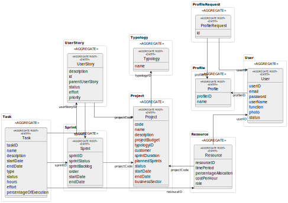

# Project Documentation Entry Point #

1. [Problem Statement](docs/ProblemStatement.md)
2. [Team Members and Tasks Distribution](docs/TeamMembersAndTasks.md)
3. [Markdown and UML templates for projectDeprecated documentation](docs/(Templates))
4. [Glossary](docs/Glossary.md)

To run the backend simply run the projectApplication. Currently, it is being exposed in http://localhost:8080/. This allows a simple view of the possible REST API endpoints with Swagger.

To run the frontend, which is being developed in React, please use the webapp folder and run the commands npm install and npm start. It is being exposed in http://localhost:3000/.

The architecture used is Onion.
The domain was modelled using Domain Driven Design. A simple diagram in svg format can be found below (open in a new tab to zoom in):

