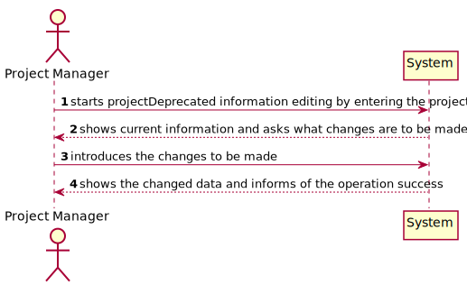
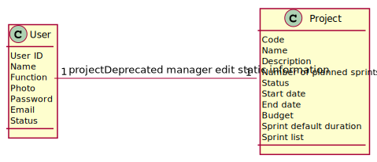
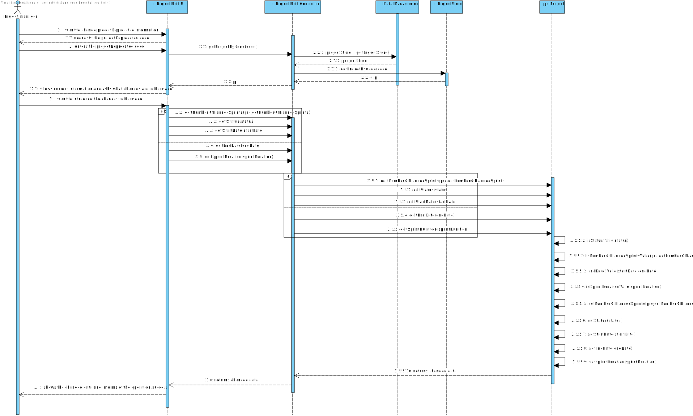
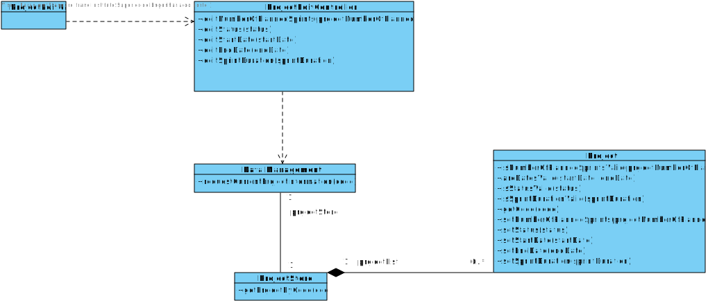

# US 008

## 1. Requirements Engineering

### 1.1. User Story Description

As Project Manager, I want to edit some projectDeprecated information.

### 1.2. Customer Specifications and Clarifications 

"Algumas informações do projeto não devem poder ser alteradas por exemplo o código. Poderia confirmar-me quais são as informações que o Project Manager pode editar?"

Nesta fase não temos uma opinião muito sólida sobre que dados podem ser alterados. Alguns parecem ser bons candidatos:

start date

sprint duration

number of planned sprints

end date

status

equipas (PO, SM, projectDeprecated team)

### 1.3. Acceptance Criteria

Edited data must be at least: start date, end date, sprint duration and 
number of planned sprints.

### 1.4. Found out Dependencies

US005 - As Director, I want to register/create a new projectDeprecated.

### 1.5 Input and Output Data

Input:

Project code

Start date

Sprint duration

Number of planned sprints

End date

Status

Output:

Boolean (projectDeprecated edited successfully or not)

### 1.6. System Sequence Diagram (SSD)

### 1.7 Other Relevant Remarks

## 2. OO Analysis

### 2.1. Relevant Domain Model Excerpt 

### 2.2. Other Remarks

## 3. Design - User Story Realization 

### 3.1. Rationale

**The rationale grounds on the SSD interactions and the identified input/output data.**

| Interaction ID | Question: Which class is responsible for... | Answer  | Justification (with patterns)  |
|:-------------  |:--------------------- |:------------|:---------------------------- |
| Step 1  		 |	showing projectDeprecated information						 | ProjectStore             | Information Expert                              |
| Step 2  		 |	introducing changes to be made						 | Project            | Creator                             |

### Systematization ##
According to the taken rationale, the conceptual classes promoted to software classes are:

Project

Other software classes (i.e. Pure Fabrication) identified: 

DataManagement

ProjectStore

ProjectEditController

## 3.2. Sequence Diagram (SD)

## 3.3. Class Diagram (CD)

# 4. Tests 

**Test 1:** Check that it is not possible to set a negative number of planned sprints. 

    @Test
    void setNegativeNumberOfPlannedSprints() {
        String code = "A123";
        int projectNumberOfPlannedSprints = 2;
        String status = "Planned";
        LocalDate startDate = LocalDate.of(2021, 5, 11);
        LocalDate endDate = LocalDate.of(2022, 7, 9);
        ProjectTeam projectTeam = new ProjectTeam();
        int sprintDuration = 2;

        Project project1 = new Project(code, name, description, projectNumberOfPlannedSprints,
                status, projectTeam, startDate, endDate, projectBudget, typology, productBacklog, sprintDuration, customer);

        ProjectEditController projectEditController = new ProjectEditController(dataManagement);
        projectStore.addCreatedNewProjectToProjectList(project1);

        assertThrows(IllegalArgumentException.class, () -> projectEditController.editNumberOfPlannedSprints("A123",
                -3));
    }

**Test 2:** Check that it is not possible to set an invalid status.

    @Test
    void setInvalidStatus() {
    String code = "A123";
    int projectNumberOfPlannedSprints = 2;
    String status = "Planned";
    LocalDate startDate = LocalDate.of(2021, 5, 11);
    LocalDate endDate = LocalDate.of(2022, 7, 9);
    ProjectTeam projectTeam = new ProjectTeam();
    int sprintDuration = 2;

        Project project1 = new Project(code, name, description, projectNumberOfPlannedSprints,
                status, projectTeam, startDate, endDate, projectBudget, typology, productBacklog, sprintDuration, customer);

        ProjectEditController projectEditController = new ProjectEditController(dataManagement);
        projectStore.addCreatedNewProjectToProjectList(project1);

        assertThrows(IllegalArgumentException.class, () -> projectEditController.editStatus("A123",
                "Finished"));
    }

# 5. Construction (Implementation)

# 6. Integration and Demo

# 7. Observations

