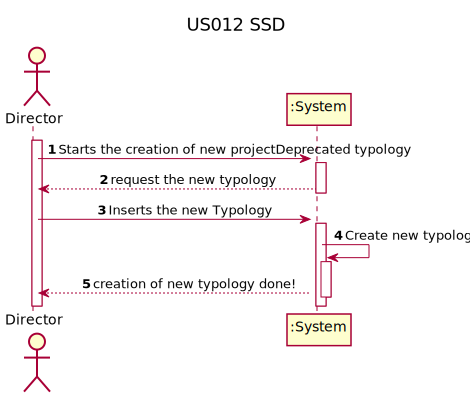
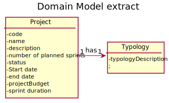
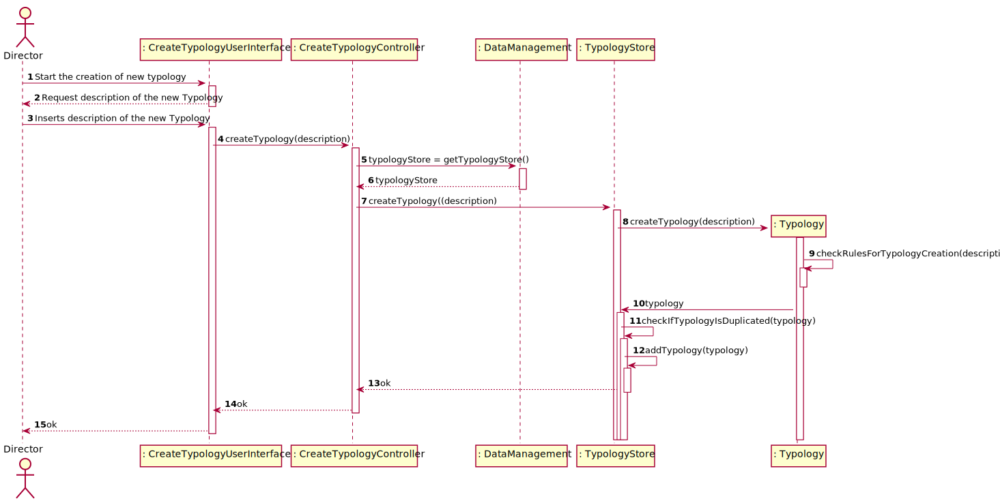
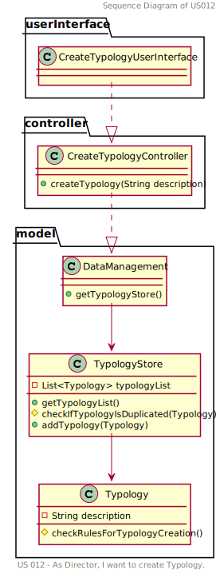

# US 012 - Start

## 1. Requirements Engineering

> As Director, I want to create a new projectDeprecated typology.

### 1.1. User Story Description

> This typology it's assumed that it's an word, or set of words, that describe the typology to be created.

### 1.2. Customer Specifications and Clarifications

**From the specifications document:**
> 2.4.1 Project registration 

Typology (Fixed Cost / Time and materials);

(page 3)

**From the client clarifications:**

* Question

> Quais serão as informações necessários para a criação de uma Typology?(Joana Fangueiro T_A)

* Answer

> A designação parece-me essencial.

### 1.3. Acceptance Criteria

> * Created by the author
> 
 - String must be between 2 and 30 chars;
> 
 - Don't create duplicated Typologies;
> 
 - ...

### 1.4. Found out Dependencies

> No dependencies found on this class.

### 1.5 Input and Output Data

* Input:

> String with word or set of words.
* Output:

> True for typology created and added to typology list.

### 1.6. System Sequence Diagram (SSD)

### 1.7 Other Relevant Remarks

> The actor inserts the description of a typology to be created.

## 2. OO Analysis

### 2.1. Relevant Domain Model Excerpt

### 2.2. Other Remarks

[//]: # (*Use this section to capture some additional notes/remarks that must be taken)

[//]: # (into consideration into the design activity. In some case, it might be usefull)

[//]: # (to add other analysis artifacts &#40;e.g. activity or state diagrams&#41;.*)

## 3. Design - User Story Realization

### 3.1. Rationale

**The rationale grounds on the SSD interactions and the identified input/output
data.**

| Interaction ID | Question: Which class is responsible for... | Answer                   | Justification (with patterns)                                                                                                                                                              |
|:---------------|:--------------------------------------------|:-------------------------|:-------------------------------------------------------------------------------------------------------------------------------------------------------------------------------------------|
| Step 1             | Interacting with the actor?                 |  CreateTypologyUI        | Responsible to be the gateway between the Actor and the Domain layer                                                                                                                       |
| Step 2             | Coordinating the US?                        | CreateTypologyController | Responsible to responding to an input event in the system generated by the User Interface                                                                                                  |
| Step 3             | Responsible for store the typologies        | DataManagement           | Responsibility of knowing all the data in the Domain Layer (GRASP Principle of Information Expert, Pure Fabrication, High Cohesion/low Coupling and Modularity)                            |
| Step 4             | Responsible for creating the Typology       | Typology                 | Conceptual class created based on the business rules with the GRASP Principle of High Cohesion/low Coupling, Modularity and Creator.                                                       |
| Step 5             | Knowing all the typologies and store them   | TypologyStore            | Responsibility of knowing all the Projects (GRASP Principle of Information Expert, Pure Fabrication, High Cohesion/low Coupling and Modularity)                                            |

### Systematization ##

According to the taken rationale, the conceptual classes promoted to software
classes are:

* DataManagement
* Typology
* TypologyStore

Other software classes (i.e. Pure Fabrication) identified:

[//]: # ( * xxxxUI  )

* TypologyUI
* TypologyController

## 3.2. Sequence Diagram (SD)

[//]: # (*In this section, it is suggested to present an UML dynamic view stating the sequence of domain related software objects' interactions that allows to fulfill the requirement.* )

## 3.3. Class Diagram (CD)

[//]: # (*In this section, it is suggested to present an UML static view representing the main domain related software classes that are involved in fulfilling the requirement as well as and their relations, attributes and methods.*)

# 4. Tests

[//]: # (*In this section, it is suggested to systematize how the tests were designed to allow a correct measurement of requirements fulfilling.* )

[//]: # (**_DO NOT COPY ALL DEVELOPED TESTS HERE_**)

**Test 1:** Check if the new typology is created and equals the input string.

        @Test
    void getDescriptionTypology() {

        //Arrange
        String expected = "New Typology";
        Typology test = new Typology("New Typology");
        //Act
        String actual = test.getDescriptionTypology();
        // Assert
        assertEquals(actual, expected);
    }

[//]: # (*It is also recommended organizing this content by subsections.* )

# 5. Construction (Implementation)

[//]: # (*In this section, it is suggested to provide, if necessary, some evidence that the construction/implementation is in accordance with the previously carried out design. Furthermore, it is recommeded to mention/describe the existence of other relevant &#40;e.g. configuration&#41; files and highlight relevant commits.*)

[//]: # ()

[//]: # (*It is also recommended to organize this content by subsections.* )

# 6. Integration and Demo

[//]: # (*In this section, it is suggested to describe the efforts made to integrate this functionality with the other features of the system.*)

# 7. Observations

[//]: # (*In this section, it is suggested to present a critical perspective on the developed work, pointing, for example, to other alternatives and or future related work.*)
> It was added as restriction the following condition:
> the input string must be between 1 and 30 characters. So with this is not possible to add a long phrase or a blank input.

