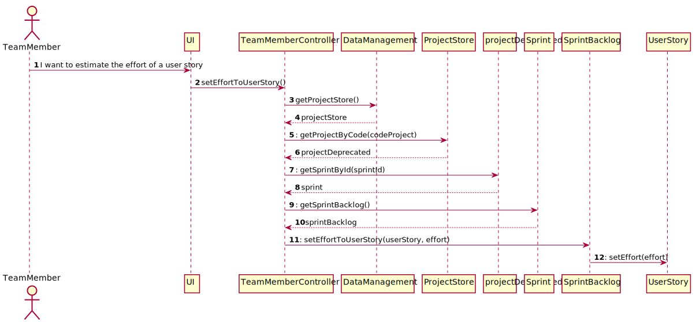
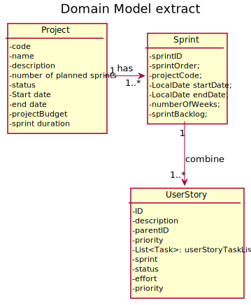
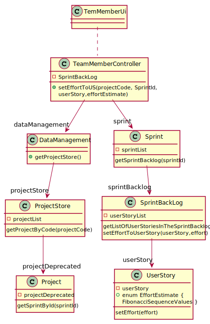

# US 019

> As TeamMember, I want to estimate the effort of a user story.

## 1. Requirements Engineering

[//]: # (*In this section, it is suggested to capture the requirement description and specifications as provided by the client as well as any further clarification on it. It is also suggested to capture the requirements acceptance criteria and existing dependencies to other requirements. At last, identfy the involved input and output data and depicted an Actor-System interaction in order to fulfill the requirement.*)

### 1.1. User Story Description

> As a Team member it's asked to set an estimated effort to a user story

### 1.2. Customer Specifications and Clarifications

**From the specifications document:**

> Effort estimate (start by having the initial estimate, but can be updated several times throughout the projectDeprecated; uses Fibonacci series for duration in hours.)

**From the client clarifications:**

* Question

> Deve a effort estimate ser guardada ao nível da task ou ao nível da User Story? Caso seja ao nível da UserStory, é necessário distribuir essa estimativa pelas tasks? Se sim, de que forma? O que é que acontece se já existir uma estimativa de esforço registada? (Marta Silveira)

* Answer

> O Scrum (mais uma vez realço a importância de lerem o Scrum Guide) tem a cerimónia Scrum Planning. Nessa altura não há tarefas, mas apenas user stories no Product Backlog. A escolha de US para o sprint tem por base uma estimativa de esforço. Nada impede que o esforço das tasks necessárias para implementar essa US seja diferente.

### 1.3. Acceptance Criteria

*Not specified*

### 1.4. Found out Dependencies

> * Class Sprint;
>* Class SprintBackLog;
>* Class UserStory.

### 1.5 Input and Output Data

> * Input:

    > Fibonacci sequence for effort;

> * Output: 

    > True for added to a userStory.

### 1.6. System Sequence Diagram (SSD)

### 1.7 Other Relevant Remarks

> The actor gets the user story of a existing sprint and associate the effort estimate

## 2. OO Analysis

### 2.1. Relevant Domain Model Excerpt

[//]: # (![US19-MD]&#40;DomainModel_G4.svg&#41;)

### 2.2. Other Remarks

[//]: # (*Use this section to capture some additional notes/remarks that must be taken into consideration into the design activity. In some case, it might be usefull to add other analysis artifacts &#40;e.g. activity or state diagrams&#41;.* )

## 3. Design - User Story Realization

### 3.1. Rationale

**The rationale grounds on the SSD interactions and the identified input/output
data.**

| Interaction ID | Question: Which class is responsible for...            | Answer              | Justification (with patterns)                                             |
|:---------------|:-------------------------------------------------------|:--------------------|:--------------------------------------------------------------------------|
| Step 1         | Interacting with the actor?                            | TeamMemberUI        | Responsible to be the gateway between the Actor and the Domain layer|
| Step 2             | Coordinating the US?                                   | TeamMemberController|Responsible to responding to an input event in the system generated by the User Interface|
| Step 3         | Knowing all the data from the domain layer?            | DataManagement      |Responsibility of knowing all the data in the Domain Layer (GRASP Principle of Information Expert, Pure Fabrication, High Cohesion/low Coupling and Modularity)|
| Step 4         | Knowing all the Projects?                              | ProjectStore        |  Responsibility of knowing all the Projects (GRASP Principle of Information Expert, Pure Fabrication, High Cohesion/low Coupling and Modularity)                   |
| Step 5         | Getting the sprints                                    | Project             |  Conceptual class created based on the business rules                           |
| Step 6         | Knowing all the sprints of a Project and creating them | Sprint              |  Conceptual class created based on the business rules with the GRASP Principle of High Cohesion/low Coupling, Modularity and Creator.                                                                         |              
| Step 7         | Knowing all the User Stories of a sprint               | SprintBacklog       |  Conceptual class created based on the business rules with the GRASP Principle of High Cohesion/low Coupling, Modularity and Creator.                                                                         |              
| Step 8         | Responsible for interacting with the User Stories      | UserStory           | Conceptual class created based on the business rules with the GRASP Principle of High Cohesion/low Coupling, Modularity and the Single Responsible Principle.  |              

### Systematization ##

According to the taken rationale, the conceptual classes promoted to software classes are: 

 * Project

 * Sprint

 * SprintBacklog

 * UserStory

Other software classes (i.e. Pure Fabrication) identified:

* DataManagement
* ProjectStore
* TeamMemberUI
* TeamMemberController

## 3.2. Sequence Diagram (SD)

## 3.3. Class Diagram (CD)

# 4. Tests

*In this section, it is suggested to systematize how the tests were designed to allow a correct measurement of requirements fulfilling.* 

**_DO NOT COPY ALL DEVELOPED TESTS HERE_**

**Test 1:** Check that it is not possible to associate an effort not listed. 

        void effortNotSet() {

        //Arrange
        UserStory newUS = new UserStory(description, priority, userStoryId);
        String description = "25 character or plus bla bla";
        int effort = 4;
        int priority = 1;
        int userStoryId = 1;

        //Act
        newUS.setEffort(effort);
        int expected = effort;
        int actual = newUS.getEffort();

        //Assert
        assertNotEquals(expected, actual);
    }

# 5. Construction (Implementation)

[//]: # (*In this section, it is suggested to provide, if necessary, some evidence that the construction/implementation is in accordance with the previously carried out design. Furthermore, it is recommeded to mention/describe the existence of other relevant &#40;e.g. configuration&#41; files and highlight relevant commits.*)

[//]: # ()

[//]: # (*It is also recommended to organize this content by subsections.* )

# 6. Integration and Demo

[//]: # (*In this section, it is suggested to describe the efforts made to integrate this functionality with the other features of the system.*)

# 7. Observations

 It was created a classe Enum for the userStory in order to be made independent and possibility the utilization with other classes. For implementation of the enum it will be created a inferface class.

