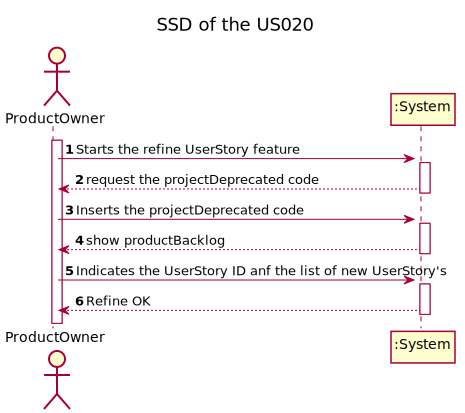
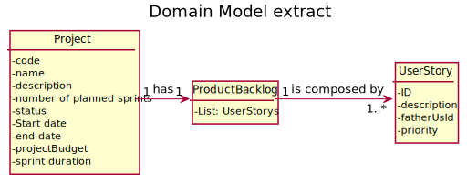
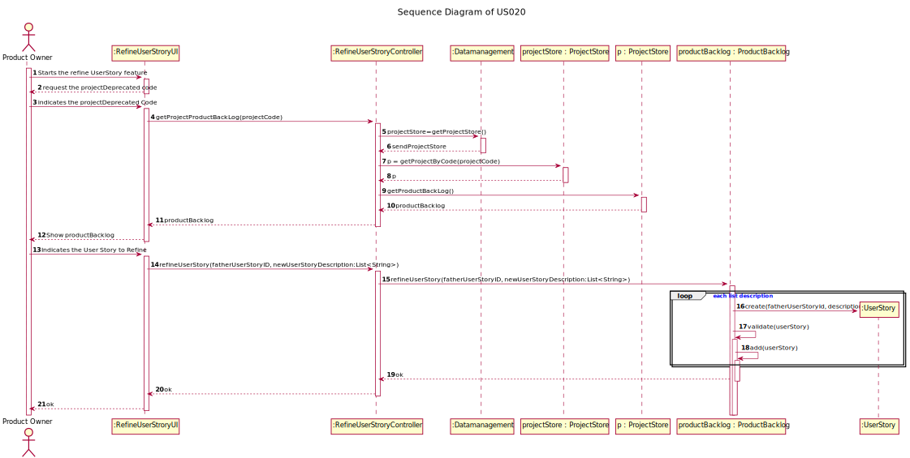
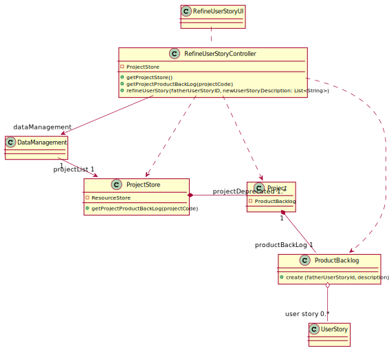

# US 020 - Start

## 1. Requirements Engineering

### 1.1. User Story Description

As Product Owner, I want to refine a broad user story of the ProductBacklog into more focused user stories

### 1.2. Customer Specifications and Clarifications 

**From the specifications document:**

n/a

**From the client clarifications:**

> **Question:** Quando uma user story é refinada, o "pai" dessas user stories mantém-se ou deixa de existir?
>
> **Answer:** Se a user story é decomposta então é substituída no product backlog pelas novas US. Mas é preciso
> manter um histórico das decompostas e das concluídas? Claro que sim!

### 1.3. Acceptance Criteria

* The father user story will be replaced by the new ones but kept in 
the historic.

### 1.4. Found out Dependencies

* There is a dependency with US009- Creation of a userStory.

### 1.5 Input and Output Data

**Input Data:**
* Typed data:
    * projectDeprecated Code.
    * user story Id.
    * list with the description of the new user stories.

  
* Selected data:
     * user story from the list.

**Output Data:**
* List of user stories to be selected,
* (In)Success of the operation.

### 1.6. System Sequence Diagram (SSD)

### 1.7 Other Relevant Remarks

n/a

## 2. OO Analysis

### 2.1. Relevant Domain Model Excerpt 

### 2.2. Other Remarks

n/a

## 3. Design - User Story Realization 

### 3.1. Rationale

**The rationale grounds on the SSD interactions and the identified input/output data.**

| Interaction ID | Question: Which class is responsible for... | Answer  | Justification (with patterns)  |
|:-------------  |:--------------------- |:------------|:---------------------------- |
| Step 1  		 |	... interacting with the actor? | RefineUserStoryUI   |  Pure Fabrication: there is no reason to assign this responsibility to any existing class in the Domain Model.           |
| |	... coordinating the US? | RefineUserStoryController | Controller                             |
| 			  		 |	... knows all existing userStory's? | ProductBacklog   | contains all the userStorys from a projectDeprecated.   |
| 			  		 |	                                  | CategoryContainer   | By applying High Cohesion (HC) + Low Coupling (LC) on class Person, it delegates the responsibility on CategoryContainer.   |
| |... knows the CategoryContainer?	|Project|	IE: Project knows the CategoryContainer to which it is delegating some responsibilities.|
| |... knows each category data?|	UserStory	|IE: Each UserStory knows its own data.
| Step 2  		 |	... showing all userStory's to be selected? | RefineUserStoryUI            |  IE: is responsible for user interactions.    || Step 3  		 |							 |             |                              |
|  Step 3         | ... knowing which userStory was selected?| RefineUserStoryUI | IE: is responsible for user interactions. |
| Step 4         | ... knowing the data of the selected userStory?| UserStory | IE: Each UserStory knows its own data. |
| Step 5         |	... create the new userStorys | Product Backlog  | IE: creates userStory's.|
| Step 6  		 |	... informing operation success?| RefineUserStoryUI  | IE: is responsible for user interactions.  | 

### Systematization ##

According to the taken rationale, the conceptual classes promoted to software classes are: 

 * Project
 * ProductBacklog
 * UserStory

Other software classes (i.e. Pure Fabrication) identified: 
 * RefineUserStoryUI  
 * RefineUserStoryController

## 3.2. Sequence Diagram (SD)

## 3.3. Class Diagram (CD)

# 4. Tests 
Two relevant test scenarios are highlighted next.
Other test were also specified.

**Test 1:** Trying to get a non-existing projectDeprecated.

      void checkReturnedProductBacklogException() {
      //Arrange
      DataManagement dataManagement = new DataManagement();
      RefineUserStoryController refineUserStoryController =
      new RefineUserStoryController(dataManagement);

      //Assert

      IllegalArgumentException exception = assertThrows
                (IllegalArgumentException.class, () ->
                        refineUserStoryController.getProjectProductBackLog(""));
        assertEquals("Project Code incorrect", exception.getMessage());
    }

# 5. Construction (Implementation)

n/a

# 6. Integration and Demo 

n/a

# 7. Observations

n/a

