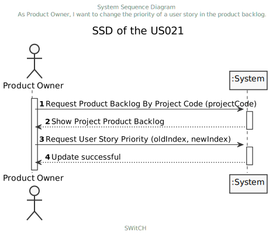
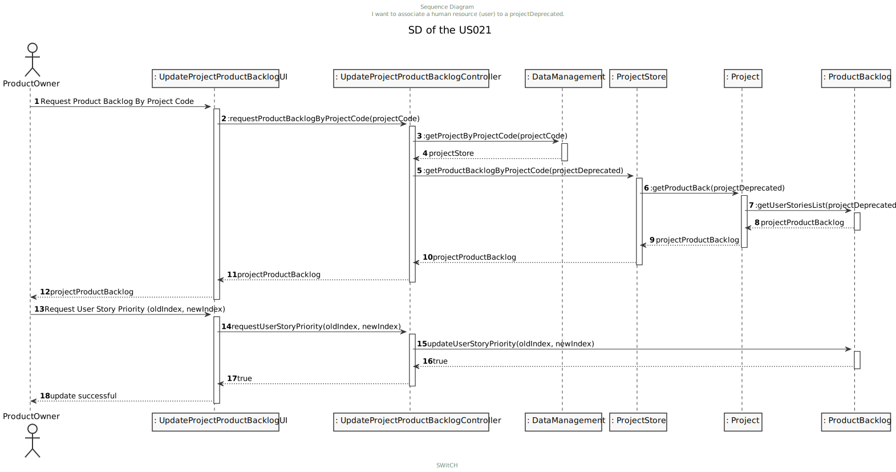

# US 021 - As Product Owner, I want to change the priority of a user story in the product backlog

## 1. Requirements Engineering

*--*

### 1.1. User Story Description

* As Product Owner, I want to change the priority of a user story in the product backlog*

### 1.2. Customer Specifications and Clarifications 

*--*

### 1.3. Acceptance Criteria

*--*

### 1.4. Found out Dependencies

*--*

### 1.5 Input and Output Data

**Input Data:**
* Typed data:
    * Project Code.
    
* Selected data:
    * User story drag & drop

**Output Data:**
* User stories priority of the product backlog updated.

### 1.6. System Sequence Diagram (SSD)

*--*

### 1.7 Other Relevant Remarks

n/a

## 2. OO Analysis

### 2.1. Relevant Domain Model Excerpt 
*In this section, it is suggested to present an excerpt of the domain model that is seen as relevant to fulfill this requirement.* 

### 2.2. Other Remarks

n/a

## 3. Design - User Story Realization 

### 3.1. Rationale

**The rationale grounds on the SSD interactions and the identified input/output data.**

| Interaction ID | Question: Which class is responsible for... | Answer               | Justification (with patterns)  |
|:-------------  |:--------------------------------------------|:---------------------|:---------------------------- |
| Step 1  		 | 		Request product backlog	                  | show product backlog |                              |
| Step 2  		 | 		Request user story priority		          | successful message   |                              |

### Systematization ##

According to the taken rationale, the conceptual classes promoted to software classes are: 

* DataManagement
* ProjectStore
* Project
* ProductBacklog

Other software classes (i.e. Pure Fabrication) identified: 
* UpdateProjectProductBacklogController  
* UpdateProjectProductBacklogController

## 3.2. Sequence Diagram (SD)

*--* 

## 3.3. Class Diagram (CD)

*--*

# 4. Tests 
*--* 

**_Test 1:_** updateProductBacklogByPriority

**_Test 2:_** updateProductBacklogByPriorityWithInvalidProject

	

*--* 

# 5. Construction (Implementation)

n/a

# 6. Integration and Demo 

n/a

# 7. Observations

n/a

