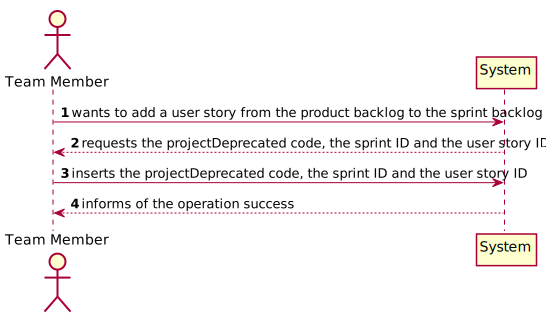

# US 023

## 1. Requirements Engineering

### 1.1. User Story Description

As Team Member, I want to add a user story in the product backlog to the sprint backlog.

### 1.2. Customer Specifications and Clarifications 

"Pergunta geral, relacionada com todas as USs: Neste ponto de sitaução, deve ser tido em conta de alguma forma o actor que executa as USs?".

Não. Isso acrescenta-se mais tarde.

"Quando associamos uma US do product Backlog ao Sprint Backlog, a qual Sprint Backlog é que ela deve ser adicionada?"

Certamente que é um sprint que está a começar, no contexto da sprint planning.
Mas tenham cuidado como implementam isso para que o código seja testável.O facto de usar o "sprint atual" não quer dizer que os métodos das classes do domínio devam ter de descobrir qual é esse sprint.

### 1.3. Acceptance Criteria

Sprint to be added to the product backlog must be a sprint that has not been started.

User story must be one whose execution has not begun.

### 1.4. Found out Dependencies

US019 - As Team Member, I want to estimate the effort of a user story.

US022 - As Project Manager, I want to create a sprint.

### 1.5 Input and Output Data

Input:

Project code

User Story ID

Sprint ID

Output:

Boolean (user story successfully added or not)

### 1.6. System Sequence Diagram (SSD)

### 1.7 Other Relevant Remarks

## 2. OO Analysis

### 2.1. Relevant Domain Model Excerpt 

### 2.2. Other Remarks

## 3. Design - User Story Realization 

### 3.1. Rationale

**The rationale grounds on the SSD interactions and the identified input/output data.**

| Interaction ID | Question: Which class is responsible for... | Answer  | Justification (with patterns)  |
|:-------------  |:--------------------- |:------------|:---------------------------- |
|Step 1  		 |	returning a projectDeprecated						 | ProjectStore             | Information Expert 
Step 2  		 |	returning the product backlog of a projectDeprecated						 | ProjectStore             | Information Expert                             |
| Step 3 		 |	returning a projectDeprecated's user story						 | ProductBacklog            | Information Expert
Step 4  		 |	returning a sprint						 | Project           | Creator
Step 5		 |	returning the sprint backlog of a sprint						 | Sprint          | Creator
| Step 6 		 |	adding a user story to a sprint backlog						 |  Project          |                              |

### Systematization ##

According to the taken rationale, the conceptual classes promoted to software classes are:

Sprint Backlog

Other software classes (i.e. Pure Fabrication) identified:

AddUserStoryToSprintBacklogController

## 3.2. Sequence Diagram (SD)

## 3.3. Class Diagram (CD)

# 4. Tests

**Test 1:** Asserts that a user story from the product backlog was successfully added to the sprint backlog. 

    @Test
    void addUserStoryFromProductBacklogToSprintBacklog() {

        //Arrange
        String projectCode1 = "Z123";
        String name = "ABC";
        String description = "Description";
        int projectNumberOfPlannedSprints = 4;
        String status = "Planned";
        LocalDate startDate1 = LocalDate.of(2023, 1, 6);
        LocalDate endDate1 = LocalDate.of(2024, 2, 6);
        Typology typology = new Typology();
        Customer customer = new Customer("Company",
                "Management", 123456789);
        int sprintDuration = 2;
        double projectBudget = 1000.0;
        Project project1 = new Project(projectCode1, name, description, projectNumberOfPlannedSprints, status, startDate1,
                endDate1, projectBudget, typology, sprintDuration, customer);
        int userStoryId = 0;
        UserStory userStory = new UserStory("Testing if this correctly creates a User Story",
                0, userStoryId);
        int sprintId = 0;
        LocalDate date1 = LocalDate.of(2023, 1, 7);
        LocalDate date2 = LocalDate.of(2022, 1, 20);
        dataManagement = new DataManagement();
        projectStore = dataManagement.getProjectStore();
        projectStore.addCreatedProjectToProjectList(project1);
        project1.getProductBacklog().addUserStory(userStory);
        Sprint sprint = new Sprint(sprintId, 1, projectCode1, date1, 1, date2);
        project1.addSprintToSprintList(sprint);
        project1.addUserStoryFromProductBacklogToSprintBacklog(userStoryId, sprintId);
        AddUserStoryToSprintBacklogController addUserStoryToSprintBacklogController =
                new AddUserStoryToSprintBacklogController(dataManagement);

        //Act
        boolean result = addUserStoryToSprintBacklogController.
                addUserStoryToSprintBacklog(projectCode1, sprintId, userStoryId);

        //Assert
        assertTrue(result);

**Test 2:** Checks that a user story with ID zero can't be added. 

    @Test
    void addUserStoryWithUserIdZero() {

        //Arrange
        String projectCode1 = "Z123";
        String name = "ABC";
        String description = "Description";
        int projectNumberOfPlannedSprints = 4;
        String status = "Planned";
        LocalDate startDate1 = LocalDate.of(2023, 1, 6);
        LocalDate endDate1 = LocalDate.of(2024, 2, 6);
        Typology typology = new Typology();
        Customer customer = new Customer("Company",
                "Management", 123456789);
        int sprintDuration = 2;
        double projectBudget = 1000.0;
        Project project1 = new Project(projectCode1, name, description, projectNumberOfPlannedSprints, status, startDate1,
                endDate1, projectBudget, typology, sprintDuration, customer);
        int userStoryId = 0;
        UserStory userStory = new UserStory("Testing if this correctly creates a User Story",
                0, userStoryId);

        LocalDate date1 = LocalDate.of(2023, 1, 7);
        LocalDate date2 = LocalDate.of(2023, 1, 8);
        dataManagement = new DataManagement();
        projectStore = dataManagement.getProjectStore();
        projectStore.addCreatedProjectToProjectList(project1);
        project1.getProductBacklog().addUserStory(userStory);
        project1.createNewSprint(date1,date1);
        project1.startASprint(1,date2);
        int sprintId = 1;
        AddUserStoryToSprintBacklogController addUserStoryToSprintBacklogController =
                new AddUserStoryToSprintBacklogController(dataManagement);

        //Act
        boolean result = addUserStoryToSprintBacklogController.
                addUserStoryToSprintBacklog(projectCode1, sprintId, userStoryId);

        //Assert
        assertFalse(result);
    }
# 5. Construction (Implementation)

# 6. Integration and Demo

# 7. Observations

