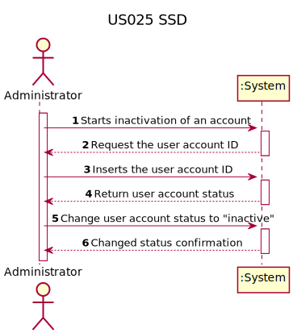
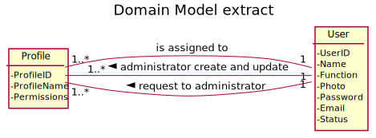
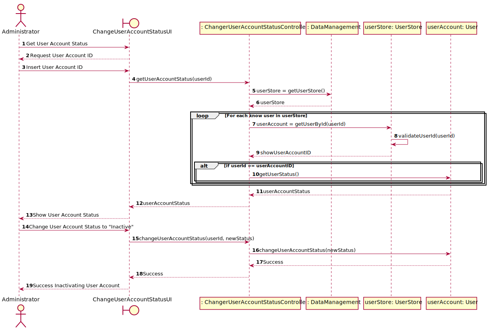
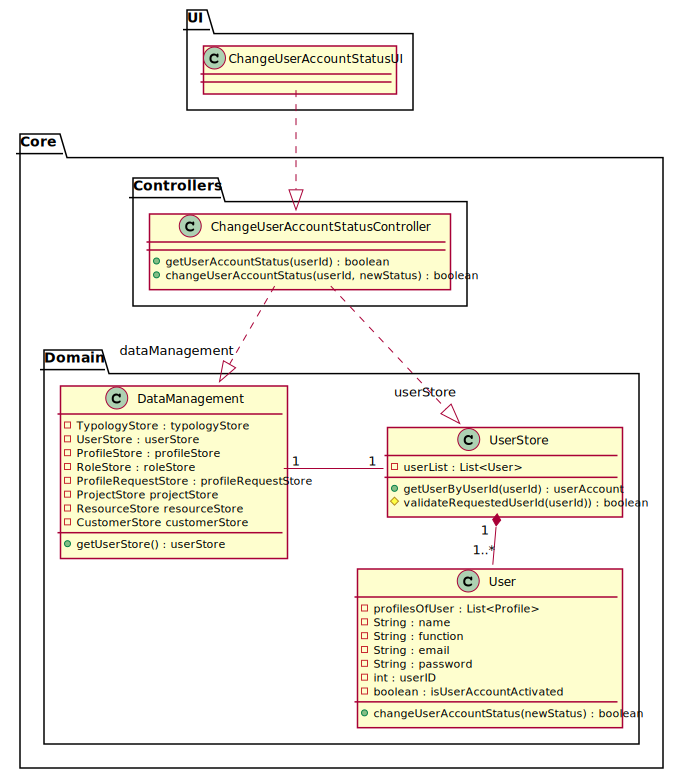

# US 25 - As Administrator, I want to inactivate a user account.

## 1. Requirements Engineering

*In this section, it is suggested to capture the requirement description and specifications as provided by the client as
well as any further clarification on it. It is also suggested to capture the requirements acceptance criteria and
existing dependencies to other requirements. At last, identfy the involved input and output data and depicted an
Actor-System interaction in order to fulfill the requirement.*

### 1.1. User Story Description

As Administrator, I want to inactivate a user account.

### 1.2. Customer Specifications and Clarifications

* Question:

> Um utilizador que esteja numa Lista de recursos de um/vários projetos poderá ter a conta desativada? (G4, 30/01)

* Answer

> Sim. Sem qualquer outra implicação no sistema. (AMM, 31/01)

### 1.3. Acceptance Criteria

The Minimal Functional Requirements and the validation of not being able to change the User Account Status to the same that it already has. 

### 1.4. Found out Dependencies

No dependencies with other User Stories were found

### 1.5 Input and Output Data

> Input:
* User Account ID : int
* New User Account Status : boolean;

> Output:
* User Account Status : boolean 
* User Account Status change Successful/Unsuccessful : boolean

### 1.6. System Sequence Diagram (SSD)

### 1.7 Other Relevant Remarks

No other relevant remarks are to be found

## 2. OO Analysis

### 2.1. Relevant Domain Model Excerpt

### 2.2. Other Remarks

No other remarks are to be described

## 3. Design - User Story Realization

### 3.1. Rationale

**The rationale grounds on the SSD interactions and the identified input/output data.**

| Interaction ID | Question: Which class is responsible for... | Answer  | Justification (with patterns)  |
|:-------------  |:--------------------- |:------------|:---------------------------- |
| Step 1 | Interacting with the Actor? | ChangeUserAccountStatusUI | Responsible to be the gateway between the Actor and the Domain layer and their interactions with one another
| Step 2         |	Getting the User Account Status by User ID | ChangerUserAccountStatusController |   Responsible to responding to an input event in the system generated by the User Interface                          |
| Step 3         |	Getting the User Store (User List) | DataManagement | Responsibility of knowing all the data in the Domain Layer  (GRASP Principle of Information Expert and Pure Fabrication)                    |
| Step 4         |	Getting the User Account by User ID | UserStore  | Responsibility of knowing all the Users by their id (GRASP Principle of low coupling/high cohesion and Pure Fabrication)                            |
| Step 5         |	Validating the inserted UserId | UserStore | To be able to get the correct User it first must validate the inserted User ID                             |
| Step 6         |	Getting the User Account Status from the user selected by User Id | User | Conceptual class created based on the business rules                         |
| Step 7         |	Change the User Account Status to new status from a User selected by user ID | ChangeUserAccountStatusController | Responsible to responding to an input event in the system generated by the User Interface                             |              
| Step 8         |  Change the User Account Status to new status | User | Conceptual class created based on the business rules
### Systematization ##

According to the taken rationale, the conceptual classes promoted to software classes are:

* User

Other software classes (i.e. Pure Fabrication) identified:
* ChangerUserAccountStatusUI
* ChangerUserAccountStatusController
* DataManagement
* UserStore

## 3.2. Sequence Diagram (SD)

## 3.3. Class Diagram (CD)

# 4. Tests

### Controller Integration Tests

**Test 1:** Check if User Account Status is correctly Deactivated

    @Test
    void ChangeUserAccountStatusTestOne() {
        // Arrange

        dataManagement = new DataManagement();
        changeUserAccountStatusController = new ChangeUserAccountStatusController(dataManagement);

        User userOne = new User("Name", "Function", "gmail@gmail.com", "password", 1);
        userOne.changeUserAccountStatus(true);
        dataManagement.getUserStore().addCreatedUserToUserList(userOne);

        // Assert

        assertTrue(changeUserAccountStatusController.getUserAccountStatus(1));
        assertTrue(changeUserAccountStatusController.changeUserAccountStatus(1, false));
        assertFalse(changeUserAccountStatusController.getUserAccountStatus(1));
    }

**Test 2:** Check if User Account Status is not changed when the same is already Deactivated
    
    @Test
    void ChangeUserAccountStatusTestFour() {
        // Arrange

        dataManagement = new DataManagement();
        changeUserAccountStatusController = new ChangeUserAccountStatusController(dataManagement);

        User userOne = new User("Name", "Function", "gmail@gmail.com", "password", 1);
        dataManagement.getUserStore().addCreatedUserToUserList(userOne);

        // Assert

        assertFalse(changeUserAccountStatusController.getUserAccountStatus(1));
        assertFalse(changeUserAccountStatusController.changeUserAccountStatus(1, false));
        assertFalse(changeUserAccountStatusController.getUserAccountStatus(1));
    }

**Test 3:** Check if exception is returned when the user with the inserted user id doesn't exist

    @Test
    void ChangeUserAccountStatusGetUserAccountStatusTestThree() {
        // Arrange

        dataManagement = new DataManagement();

        changeUserAccountStatusController = new ChangeUserAccountStatusController(dataManagement);

        User userOne = new User("Name", "Function", "gmail@gmail.com", "password", 1);
        userOne.changeUserAccountStatus(true);
        dataManagement.getUserStore().addCreatedUserToUserList(userOne);

        // Act
        IllegalArgumentException exception = assertThrows(IllegalArgumentException.class, () ->
                changeUserAccountStatusController.getUserAccountStatus(2));

        // Assert
        assertEquals("User with ID: " + 2 + " Was not found or it doesn't exist", exception.getMessage());
    }
# 5. Construction (Implementation)

The only constructing that was made here was the addition of a method to change the User Account Status, which was the first implementation made.

After this was done, we created the controller class to be able to fully integrate all the elements of the User Story in question.

# 6. Integration and Demo

The integration of this functionality was fairly straight forward since there was no need of creating new classes. All the classes that are used were already implemented from previous User Stories.

There was, however, the need of creating a new method in the Class User that allows the Actor (In this case the administrator) to change the User
Account Status from active to inactive with the requirement of not being able to change to the same User Account Status.

Additionally, there was some further code refactoring in the Class UserStore ir order to validate correctly the user id inputted by the actor.

# 7. Observations

The inicial planned implementation of the User Story involved the validation of the User Account not being able to be deactivated if the User is either allocated to one or more Projects. This implementation was scraped when asked the PO about this feature and he answered that the only needed validation was to not being able to Deactivate the User Account if it's already deactivated.

Eventually the use of a DTO to return a list of the users and their account status to use as reference to see which User to Deactivate. Aldo this was also implemented it was eventually scraped do to further knowledge of the usage of DTO, noticing it was irrelevant to meet the Minimal Functional Requirements,

The final version of the User Story contains only two methods. One to get the User Account Status and another to Change the User Account Status, in this case deactivating it. It became more obvious that the User Story was alot more simple than previously thought, leading to the few final days of the sprint to fully implement and test the User Story due to all the previous changes mentioned before.

