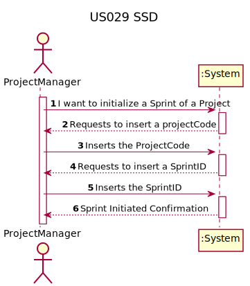
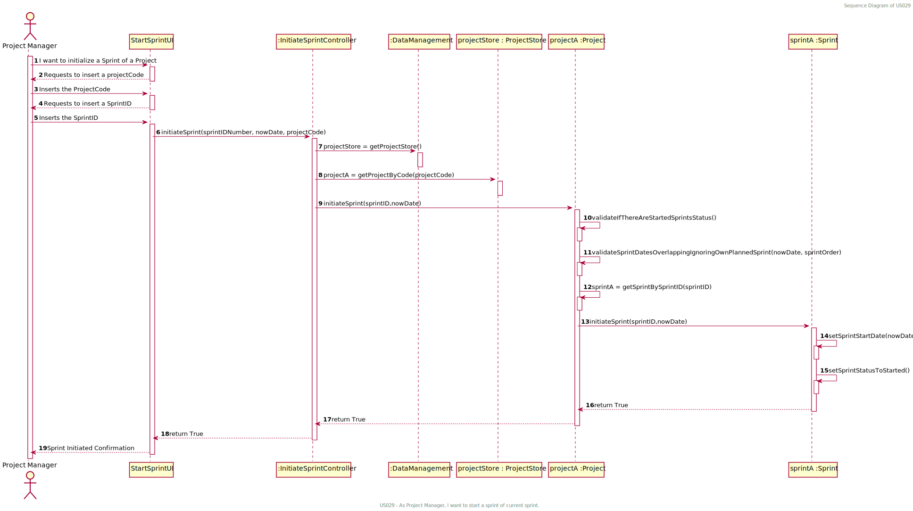
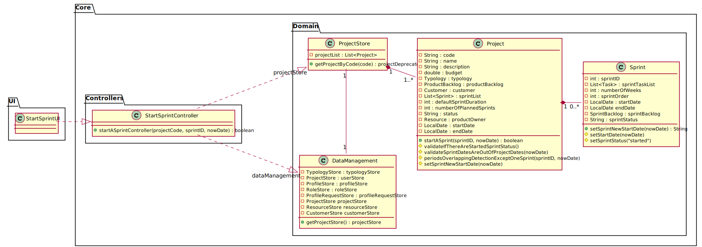

# US029 - As Project Manager, I want to start a sprint

## 1. Requirements Engineering

### 1.1. User Story Description

As Project Manager, I want to start a sprint

### 1.2. Customer Specifications and Clarifications 

*Questão:

>O que implica começar um sprint?

*Resposta:

>PO A equipa pode começar a trabalhar (AMM, 27/01)

*Questão:

>De modo a entendermos: quais os eventos que marcam o ínicio e o fim do que a US029 indica como "Start a Sprint" efetuada pelo PM, pergunto: O que é que poderemos considerar "start a Sprint"?

>Opção1 (assumindo que a SprintPlanning faz parte da Sprint)

>Iniciado com a tarefa de SPRINT PLANING, em que há a atribuição das US ao sprint-backlog.
A data do sprint planning passa a marcar o inicio do Sprint
A partir do momento que são adicionadas todas as US escolhidas para o Sprint backlog, o PM "fecha" o SprintPlanning, e a partir desse momento não podem ser adicionadas mais US.
Automaticamente, é dada a permissão para que o resto da equipa possa "pegar" nas US (já no SprintBacklog) , desdobrá-las em tasks e atribuir o respectivo effort.

>Opção2 (assumindo que a SprintPlanning não faz parte da Sprint)

>É dada a permissão (pelo PM) para o resto da equipa desdobrar as US que estão no SprintBacklog em Tasks… Assim como a atribuição do effort destas tarefas.
A data desta alteração de estado, (em que são dadas estas permissões), passa a marcar o real inicio do Sprint.
PO O sprint passa para o estado de iniciado na data definida pelo PM. Quanto ao resto, ainda não estão definidas user stories sobre o Sprint Planning, etc. (AMM, 03/02)

*Resposta:

>O PM pode iniciar o Sprint antes da data previamente planeada? E iniciar depois?
>PO Se assim não fosse, qual seria o objetivo desta user story? (AMM, 03/02)

*Questão:

>Caso dê para ser iniciada depois da data planeada, pode ser iniciado no período de um Sprint posterior?

*Resposta:

>PO Claro. Apenas pode haver um sprint ativo num dado instante, ou seja, não há sprints sobrepostos. Lembro que os sprints têm uma numeração sequencial.(AMM, 03/02)

*Questão:

>Caso dê para ser iniciado no periodo de um Sprint Posterior, qual o procedimento pretendido pelo cliente:

>opção 1: emitida uma mensagem de erro e é pedido que se corrijam as datas dos sprints planeados em conflito, e só depois é que pode ser inicializado o Sprint.
opção 2: o sprint é inicializado e todos os restantes Sprints são atrasados o perido de tempo correspondente ao Sprint iniciado.

*Resposta:

>PO Nenhum. Não tem que fazer nada. (AMM, 03/02)
### 1.3. Acceptance Criteria

When the Project Manager starts a sprint, the program should validate that there is no type of overlapping with other 
Sprints, nor there are other sprints open (Started and not finished).
The status of the sprint must change to "started" and it must be set the new sprint Start date and End date (end date calculated by 
adding the sprint duration on the start date)

### 1.4. Found out Dependencies

The creation of tasks on Sprint UserStories is only possible when the Sprint Status is set to "Started" therefore a team member is not allowed to change the US status (on that sprint, i.e. the US ScrumBoard status) nor create a task on a US (on that projectDeprecated), without the Sprint having started.
The transfer of a User Story from the Product Backlog to the Sprint Backlog is only possible when the Sprint has not started yet (sprint status = "notStarted")
US22

### 1.5 Input and Output Data

*INPUTS
1) Project Manager (PM) Inputs the Sprint ID <Integer> - the best option would be that the actor selects one Sprint from a sprint list (with some information such as sprintOrderNumber, id, start and end date, status) in order to know which Sprint wants to initiate, but for now we assume the PM knows the sprintID. 
2) Project Code <String> is inserted by the actor (PM) 
3) The Now date <LocalDate> (date of the moment of submission) is also an input parameter, but is given by the interface.

*OUTPUTS
A confirmation (boolean true/false) in case the Sprint was successfully started or not (respectively)

### 1.6. System Sequence Diagram (SSD)

### 1.7 Other Relevant Remarks

No other relevant remarks were found.

## 2. OO Analysis

### 2.1. Relevant Domain Model Excerpt

### 2.2. Other Remarks

No other remarks.

## 3. Design - User Story Realization 

### 3.1. Rationale

**The rationale grounds on the SSD interactions and the identified input/output data.**

| Interaction ID | Question: Which class is responsible for... | Answer  | Justification (with patterns)  |
|:-------------  |:--------------------- |:------------|:---------------------------- |
| Step 1  		 |	Interacting with the actor?	 | StartASprintUI  | Responsible to be the gateway between the Actor and the Domain layer and their interactions with one another                              |
| Step 2  		 |	Who responds from an input event generated by the UI? | StartASprintController  | Responsible to responding to an input event in the system generated by the User Interface                              |
| Step 3  		 |	Knowing all the data from the domain layer?	 | DataManagement | Responsibility of knowing all the data in the Domain Layer (GRASP Principle of Information Expert, Pure Fabrication, High Cohesion/low Coupling and Modularity)                             |
| Step 4  		 |	Knowing all the Projects?  | ProjectStore | Responsibility of knowing all the Projects (GRASP Principle of Information Expert, Pure Fabrication, High Cohesion/low Coupling and Modularity)                           |
| Step 5  		 |	Getting the Sprint by the Sprint ID searching the Sprint List | Project | Conceptual class created based on the business rules                             |
| Step 6  		 |	Setting the Sprint Status to "Started" and setting the new start and end date | Sprint | Conceptual class created based on the business rules with the GRASP Principle of High Cohesion/low Coupling, Modularity and Creator.                            |              

### Systematization ##

According to the taken rationale, the conceptual classes promoted to software classes are: 

 * Project
 * Sprint

Other software classes (i.e. Pure Fabrication) identified: 
 * StartASprintUI
 * StartASprintController

## 3.2. Sequence Diagram (SD)

## 3.3. Class Diagram (CD)

# 4. Tests 
*In this section, it is suggested to systematize how the tests were designed to allow a correct measurement of requirements fulfilling.* 

**_DO NOT COPY ALL DEVELOPED TESTS HERE_**

**Test 1:** Check that it is not possible to create an instance of the Example class with empty values. 

    class ExampleFixture : public ::testing::Test {
        TEST_F(ExampleFixture, CreateWithEmptyCode){
            EXPECT_THROW(new Example(L"",L"Example One"),std::invalid_argument);
        }
    }
	

*It is also recommended organizing this content by subsections.* 

# 5. Construction (Implementation)

*In this section, it is suggested to provide, if necessary, some evidence that the construction/implementation is in accordance with the previously carried out design. Furthermore, it is recommeded to mention/describe the existence of other relevant (e.g. configuration) files and highlight relevant commits.*

*It is also recommended to organize this content by subsections.* 

# 6. Integration and Demo 

*In this section, it is suggested to describe the efforts made to integrate this functionality with the other features of the system.*

# 7. Observations

*In this section, it is suggested to present a critical perspective on the developed work, pointing, for example, to other alternatives and or future related work.*

