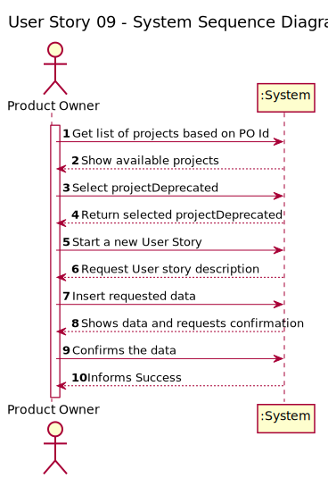
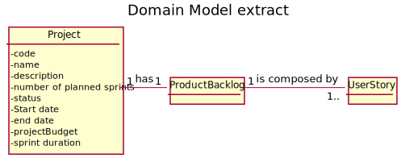
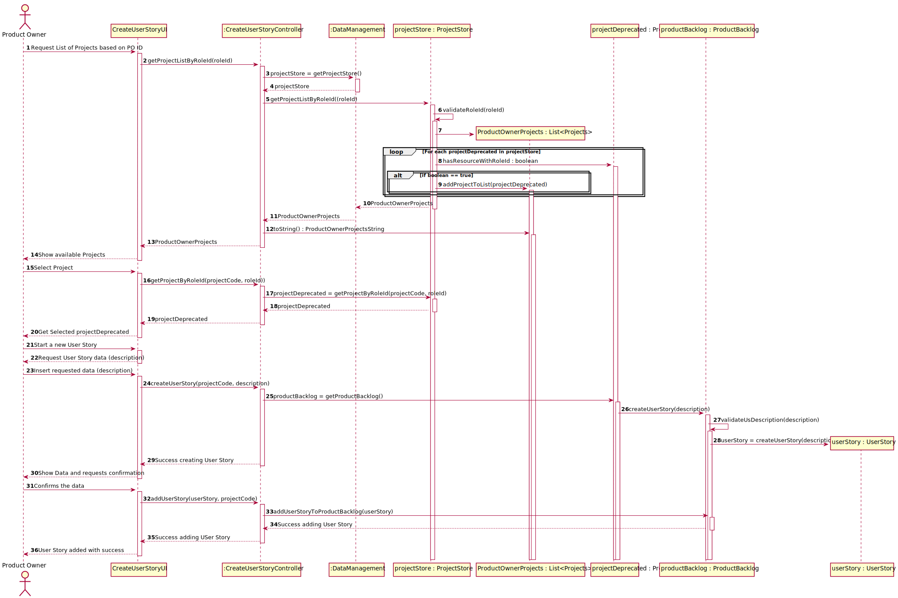
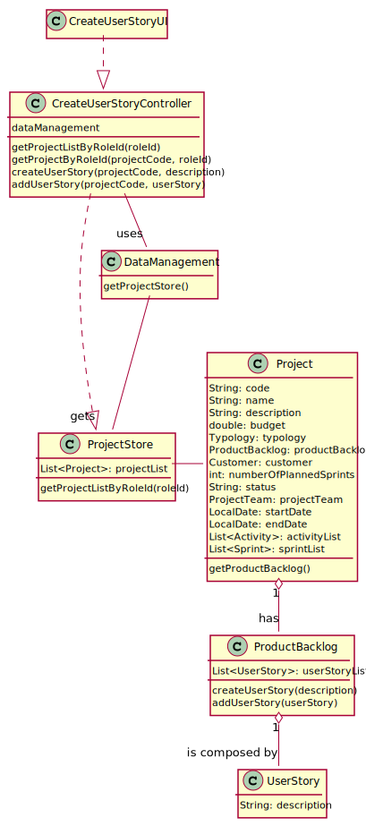

# US 09 - As Product Owner, I want to create a user story and add it to the Product Backlog.

## 1. Requirements Engineering

### 1.1. User Story Description

As Product Owner, I want to create a user story and add it to the Product Backlog.

### 1.2. Customer Specifications and Clarifications 

The Product Backlog is the class responsible for creating a User Story.

### 1.3. Acceptance Criteria

The Product Backlog and User Story must have a specific case of association denominated Composition. Since the existence of a User Story cannot be outside of a Product Backlog

### 1.4. Found out Dependencies

There is a dependency with US5 (As Director, I want to register/create a new projectDeprecated) because a Product Backlog cannot exist outside of a Project.

### 1.5 Input and Output Data

> Input:
* Product Owner ID : Int
* Project Code : String
* User Story Description : String

> Output:
* Project List : List
* Project : Project
* User Story : User Story

### 1.6. System Sequence Diagram (SSD)

### 1.7 Other Relevant Remarks

## 2. OO Analysis

### 2.1. Relevant Domain Model Excerpt 

### 2.2. Other Remarks

There is also a Composition between Project and Product Backlog.

## 3. Design - User Story Realization 

### 3.1. Rationale

**The rationale grounds on the SSD interactions and the identified input/output data.**

| Interaction ID | Question: Which class is responsible for... | Answer  | Justification (with patterns)  |
|:-------------  |:--------------------- |:------------|:---------------------------- |
| Step 1  		 |	Interacting with the actor?	 | CreateUserStoryUI  | Responsible to be the gateway between the Actor and the Domain layer and their interactions with one another                              |
| Step 2  		 |	Who responds from an input event generated by the UI? | CreateUserStoryController  | Responsible to responding to an input event in the system generated by the User Interface                              |
| Step 3  		 |	Knowing all the data from the domain layer?	 | DataManagement | Responsibility of knowing all the data in the Domain Layer (GRASP Principle of Information Expert, Pure Fabrication, High Cohesion/low Coupling and Modularity)                             |
| Step 4  		 |	Knowing all the Projects?  | ProjectStore | Responsibility of knowing all the Projects (GRASP Principle of Information Expert, Pure Fabrication, High Cohesion/low Coupling and Modularity)                           |
| Step 5  		 |	Getting the Product Backlog | Project | Conceptual class created based on the business rules                             |
| Step 6  		 |	Knowing all the User Stories of a Project and creating them | ProductBacklog | Conceptual class created based on the business rules based on the GRASP Principle of High Cohesion/low Coupling and Modularity.                            |                    
| Step 7         |  Responsible for interacting with the User Stories | User Story | Conceptual class created based on the business rules with the GRASP Principle of High Cohesion/low Coupling, Modularity and the Single Responsible Principle.
### Systematization ##

According to the taken rationale, the conceptual classes promoted to software classes are: 

 * Project
 * Product Backlog
 * User Story

Other software classes (i.e. Pure Fabrication) identified: 
 * CreateUserStoryUI  
 * CreateUserStoryController
 * DataManagement
 * ProjectStore

## 3.2. Sequence Diagram (SD)

## 3.3. Class Diagram (CD)

# 4. Tests 

# 5. Construction (Implementation)

The approach to this implementation was deconstructing the domain layer into to smaller parts, meaning that the first class created was the User story Class and then
Product Backlog and then lastly the Controller Class.

When constructing the Product Backlog, it was important to make sure that it's composed by User Stories, implicating that the only attribute
of the class is a List of User Stories.

The same principle was applied when integrating the Product Backlog with the Project Class, therefore one of the attribute of the Project Class
is a instance of the Product Backlog.

The controller class was the final class to be implemented since it needed the smaller parts to be working correctly.  

# 6. Integration and Demo 

Since this was the first sprint, all the implementation was made from scratch except for the Project Class as it was added from another User Story.

This proved to be a little changeling as this was the first time applying the software design patters taught in classes such as Information Expert, Creator, Controller and High Cohesion/Low coupling.

The Design Pattern of High Coesion/Low coupling showed to be the one where there were the most doubts following, this was because, originally, there were no Store classes inserted which led to the
Data Management Class having to many responsibilities in the Domain Layer. This was, however, changed in the second sprint following more the High Cohesion/Low coupling pattern.

# 7. Observations

This implementation, while difficult, proved to be one of the most important ones since it created the foundation to future User Stories that need to interact with
elements such as Product Backlog and User Stories.

