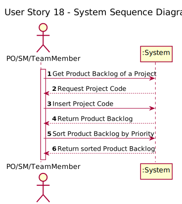
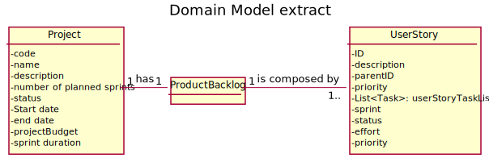
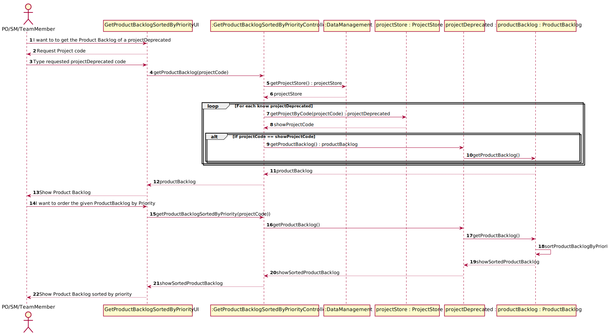
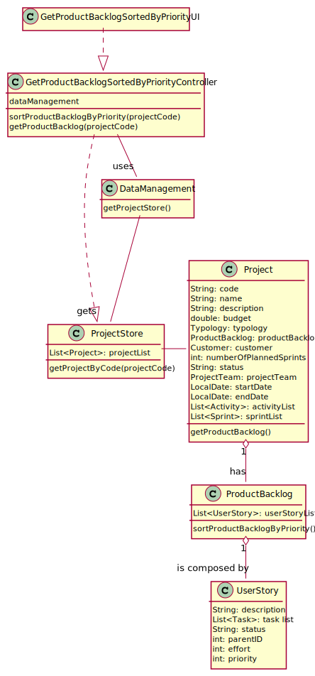

# US 18 - As PO/SM/Team Member, i want to consult the product backlog, i.e to get the list of user stories sorted by priority

## 1. Requirements Engineering

### 1.1. User Story Description

As PO/SM/Team Member, I want to consult the product backlog, i.e. to get the list of user stories sorted by priority

### 1.2. Customer Specifications and Clarifications 

**From the Client Specifications:**

User Story Priority must be a unique value for each, being 1 the highest priority possible.

### 1.3. Acceptance Criteria

* The Product Backlog is sorted with by user story priority in the correct ascending order. 

### 1.4. Found out Dependencies

There are no dependencies associated with other User Stories (Other than those implemented in the previous sprint).

### 1.5 Input and Output Data

> Input:
* Project Code : String

> Output:
* Product Backlog : List<UserStory>
* Sorted Product Backlog : List<UserStory>

### 1.6. System Sequence Diagram (SSD)

### 1.7 Other Relevant Remarks

The Actor gets the Product Backlog of a projectDeprecated and then chooses if he wants it sorted by priority or not

## 2. OO Analysis

### 2.1. Relevant Domain Model Excerpt 

### 2.2. Other Remarks

There are none remarks to mention

## 3. Design - User Story Realization 

### 3.1. Rationale

**The rationale grounds on the SSD interactions and the identified input/output data.**

| Interaction ID | Question: Which class is responsible for... | Answer  | Justification (with patterns)  |
|:-------------  |:--------------------- |:------------|:---------------------------- |
| Step 1  		 |	Interacting with the actor?	 | GetProductBacklogSortedByPriorityUI  | Responsible to be the gateway between the Actor and the Domain layer and their interactions with one another                              |
| Step 2  		 |	Who responds from an input event generated by the UI? | GetProductBacklogSortedByPriorityController  | Responsible to responding to an input event in the system generated by the User Interface                              |
| Step 3  		 |	Knowing all the data from the domain layer?	 | DataManagement | Responsibility of knowing all the data in the Domain Layer (GRASP Principle of Information Expert, Pure Fabrication, High Cohesion/low Coupling and Modularity)                             |
| Step 4  		 |	Knowing all the Projects?  | ProjectStore | Responsibility of knowing all the Projects (GRASP Principle of Information Expert, Pure Fabrication, High Cohesion/low Coupling and Modularity)                           |
| Step 5  		 |	Getting the Product Backlog | Project | Conceptual class created based on the business rules                             |
| Step 6  		 |	Knowing all the User Stories of a Project and creating them | ProductBacklog | Conceptual class created based on the business rules with the GRASP Principle of High Cohesion/low Coupling, Modularity and Creator.                            |              
| Step 7         |  Responsible for interacting with the User Stories | User Story | Conceptual class created based on the business rules with the GRASP Principle of High Cohesion/low Coupling, Modularity and the Single Responsible Principle.
### Systematization ##

According to the taken rationale, the conceptual classes promoted to software classes are: 

 * Project
 * ProductBacklog
 * UserStory

Other software classes (i.e. Pure Fabrication) identified: 
 * GetProductBacklogSortedByPriorityUI  
 * GetProductBacklogSortedByPriorityController
 * ProjectStore
 * DataManagement

## 3.2. Sequence Diagram (SD)

## 3.3. Class Diagram (CD)

# 4. Tests 

# 5. Construction (Implementation)

All the classes needed were already constructed in the domain layer, therefore there was only the need of altering and implementing a few things.

First, since the only attribute of the User Story was the description, there was the need of applying the priority attribute to fully follow this implementation. This attribute was added with the condition that any user story that is created 
there is an incrementation in the priority, meaning that the first user story that is created has priority one and so on so forth.

After these adjustments, we processed to the creation of the sorting method on the product Backlog class.

Finally, we created the controller class to be able to fully integrate all the elements of the User Story in question.

# 6. Integration and Demo 

With the implementation of this User Story a few challenges rose up, mainly the creation of the sorting method in the Product Backlog Class
and the additional attributes added to User Story Class.

The rest was fairly straight forward since there was no need of creating new classes. All the classes that are used were already implemented from previous User Stories.

The creation of the sorting method was by far the biggest trial to correctly implement in this User Story, spending almost more than half the time of this sprint
researching and rewriting and testing the method several times until it did what it was supposed to.

By the end this method involved the usage of a Comparator Interface where i had to override the compare method of said interface to able to compare
the priority of the user story inside the list that is returned from the method.

# 7. Observations

While it was definitely difficult, specially coming from the first sprint where most implantation was about creating something, this user story helped solidify a few new concepts when it comes to Interfaces and
it also helped to overcome a few issues i had with the algorithmic side of coding. Hopefully this implementation can be further expanded upon
with possible sorting by other User Story Attributes.

