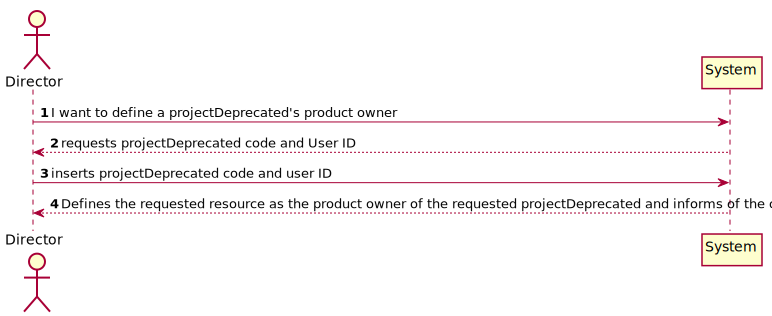
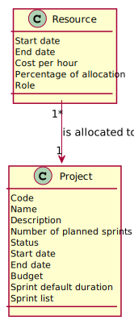
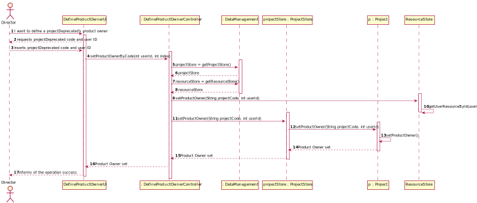

# US 027

## 1. Requirements Engineering

### 1.1. User Story Description

As Director, I want to define the PO of a projectDeprecated.

### 1.2. Customer Specifications and Clarifications 

De acordo com o enunciado do projeto, o PO, bem como os outros membros da equipa, não devem mudar durante um sprint. No entanto, na última sprint review foi apontado pelos POs que isto poderia ser muito restritivo, pois devido a alguma situação imprevista, pode ser necessário substituir um recurso a qualquer momento. Para o nosso projeto, e especificamente para a US27, a data de início de funções de um PO pode ser qualquer uma, depois da data de início do projeto, ou deve necessariamente coincidir com a data de início de um sprint? (G6, 28/01)

O PO pode ser trocado em qualquer altura. (AMM, 31/01)

### 1.3. Acceptance Criteria

The Product Owner can be changed at any time.

### 1.4. Found out Dependencies

US004 - As Administrator, I want to search for users.

US005 - As Director, I want to register/create a new projectDeprecated.

US006 - As Administrator, I want to update profiles assigned to a user account.

US007 - As Director, I want to associate a human resource (user) to a projectDeprecated.

### 1.5 Input and Output Data

Input:

Project Code

User ID

Output:

Boolean

### 1.6. System Sequence Diagram (SSD)

### 1.7 Other Relevant Remarks

## 2. OO Analysis

### 2.1. Relevant Domain Model Excerpt 

### 2.2. Other Remarks

## 3. Design - User Story Realization 

### 3.1. Rationale

**The rationale grounds on the SSD interactions and the identified input/output data.**

| Interaction ID | Question: Which class is responsible for... | Answer  | Justification (with patterns)  |
|:-------------  |:--------------------- |:------------|:---------------------------- |
| Step 1  		 |	selecting the projectDeprecated with the inserted code						 |  ProjectStore           | Information Expert                             |
| Step 2  		 |	selecting a resource						 | ResourceStore            |  Information Expert                            |
| Step 3  		 |	associating a Product Owner to the projectDeprecated						 | Project            | Creator                             | 

### Systematization ##

Other software classes (i.e. Pure Fabrication) identified:  
 * DefineProductOwnerController

## 3.2. Sequence Diagram (SD)

## 3.3. Class Diagram (CD)

# 4. Tests 

**Test 1:** Check that it is not possible to set a non-existing resource as product owner.

    @Test
    void setNonExistingResourceAsProductOwner() {

        //Arrange
        String code = "Z123";
        String name = "ABC";
        String description = "Description";
        int projectNumberOfPlannedSprints = 4;
        String status = "Planned";
        LocalDate startDate = LocalDate.of(2022, 1, 6);
        LocalDate endDate = LocalDate.of(2022, 2, 6);
        Typology typology = new Typology();
        Customer customer = new Customer("Company", "Management", 123456789);
        int sprintDuration = 15;
        double projectBudget = 1000.0;
        Project project1 = new Project(code, name, description, projectNumberOfPlannedSprints, status,
                startDate, endDate, projectBudget, typology,  sprintDuration, customer);
        Resource userOne = new Resource();
        int userId = 2;
        dataManagement = new DataManagement();
        resourceStore = dataManagement.getResourceStore();
        projectStore = dataManagement.getProjectStore();
        DefineProductOwnerController defineProductOwnerController = new DefineProductOwnerController(dataManagement);

        //Act
        userOne.setUserId(userId);
        resourceStore.addNewResourceToResourceStore(userOne);
        projectStore.addCreatedNewProjectToProjectList(project1);

        //Assert
        assertThrows(IllegalArgumentException.class, () -> defineProductOwnerController.setProductOwner(code, 3));
    }

# 5. Construction (Implementation)

# 6. Integration and Demo 

# 7. Observations

