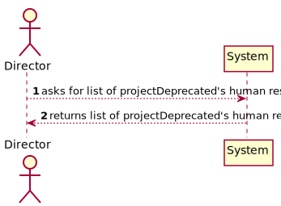
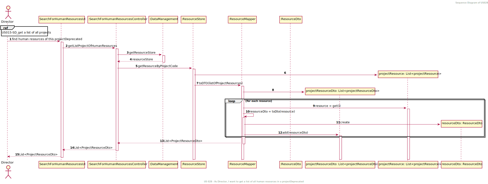
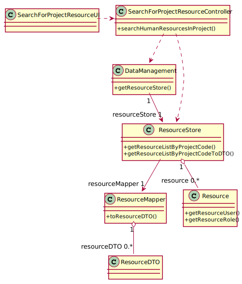

# US 28 - Start

## 1. Requirements Engineering

*In this section, it is suggested to capture the requirement description and specifications as provided by the client as
well as any further clarification on it. It is also suggested to capture the requirements acceptance criteria and
existing dependencies to other requirements. At last, identfy the involved input and output data and depicted an
Actor-System interaction in order to fulfill the requirement.*

### 1.1. User Story Description

*As Director, I want to get a list of all human resources in a projectDeprecated.*

### 1.2. Customer Specifications and Clarifications

*Pretende visualizar os recursos ativos ou todos aqueles que já participaram no projeto?

PO Todos afetos ao projeto. (AMM, 27/01)

Que informações devem ser devolvidas/fornecidas ao utilizador do sistema sobre os recursos humanos alocados a um
determinado projecto. Basta, por exemplo, o nome e e-mail dos recursos ou é necessário fornecer mais dados?

PO Nome, email e função parecem adequados. (AMM, 03/02)*

### 1.3. Acceptance Criteria

*Not specified*

### 1.4. Found out Dependencies

*This user starts once us15 is completed (us15 gets a list of projects)*

### 1.5 Input and Output Data

*The input data given is the code of the projectDeprecated whose resources are to be found. this code is given by the actor
through selection of the projectDeprecated in the list given in US015. The output data is a list of human resources containing the
name and role within the projectDeprecated of each.*

### 1.6. System Sequence Diagram (SSD)

### 1.7 Other Relevant Remarks

*Use this section to capture other relevant information that is related with this US such as (i) special requirements
; (ii) data and/or technology variations; (iii) how often this US is held.*

## 2. OO Analysis

### 2.1. Relevant Domain Model Excerpt

*In this section, it is suggested to present an excerpt of the domain model that is seen as relevant to fulfill this
requirement.*

### 2.2. Other Remarks

*No remarks*

## 3. Design - User Story Realization

### 3.1. Rationale

**The rationale grounds on the SSD interactions and the identified input/output data.**

| Interaction ID | Question: Which class is responsible for... | Answer  | Justification (with patterns)  |
|:-------------  |:--------------------- |:------------|:---------------------------- |
| Step 1         |    asking the domain layer for a list of resources |SearchForHumanResourcesInProjectController |                              |
| Step 2         |    getting the list of resources and give it to controller| DataManagement|             |
| Step 3         |    having the list of resources| ResourceStore|                              |
| Step 4         |    knowing resource's attributes| Resource|                              |
| Step 5         |    filtering resource list by projectDeprecated| ResourceStore|                              |
| Step 6         |	creating a list with the data asked	 |ResourceMapper             |                              |              

### Systematization ##

According to the taken rationale, the conceptual classes promoted to software classes are:

* Resource

Other software classes (i.e. Pure Fabrication) identified:

* SearchForHumanResourcesInProjectController
* DataManagement
* ResourceStore

## 3.2. Sequence Diagram (SD)

## 3.3. Class Diagram (CD)

# 4. Tests

*In this section, it is suggested to systematize how the tests were designed to allow a correct measurement of
requirements fulfilling.*

**_DO NOT COPY ALL DEVELOPED TESTS HERE_**

**Test 1:** Check that it is not possible to create an instance of the Example class with empty values.

    class ExampleFixture : public ::testing::Test {
        TEST_F(ExampleFixture, CreateWithEmptyCode){
            EXPECT_THROW(new Example(L"",L"Example One"),std::invalid_argument);
        }
    }

*It is also recommended organizing this content by subsections.*

# 5. Construction (Implementation)

*In this section, it is suggested to provide, if necessary, some evidence that the construction/implementation is in
accordance with the previously carried out design. Furthermore, it is recommeded to mention/describe the existence of
other relevant (e.g. configuration) files and highlight relevant commits.*

*It is also recommended to organize this content by subsections.*

# 6. Integration and Demo

*In this section, it is suggested to describe the efforts made to integrate this functionality with the other features
of the system.*

# 7. Observations

*In this section, it is suggested to present a critical perspective on the developed work, pointing, for example, to
other alternatives and or future related work.*

