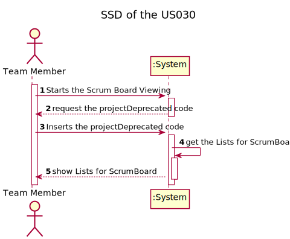
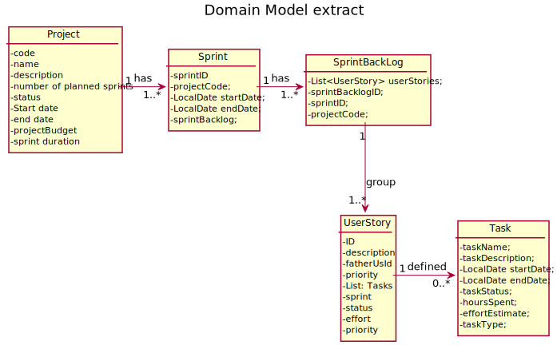
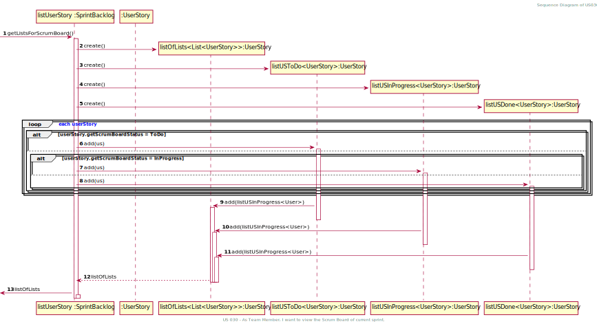
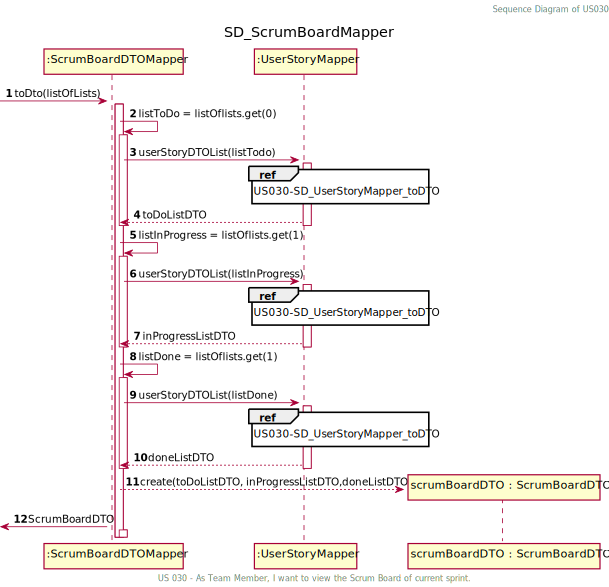
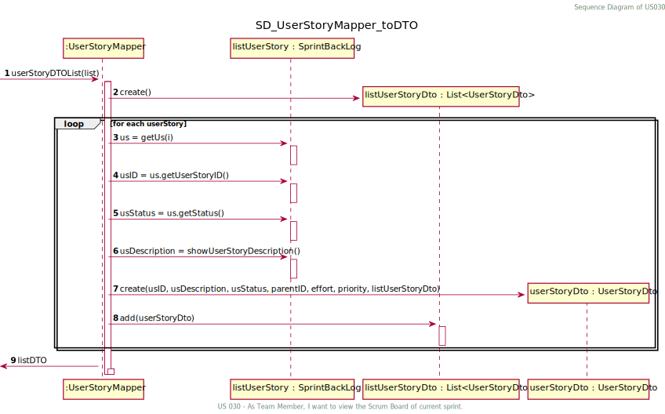
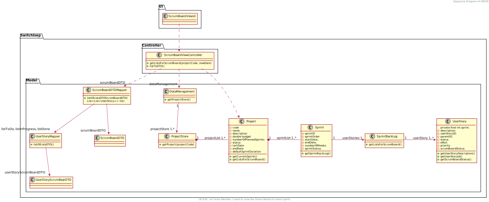

# US 030 - I want to view the Scrum Board of current sprint.

## 1. Requirements Engineering

### 1.1. User Story Description

* As Team Member, I want to view the Scrum Board of current sprint.

### 1.2. Customer Specifications and Clarifications 

**From the specifications document:**

n/a

**From the client clarifications:**

> **Question:** US30 O scrum board é uma listagem das us no sprint backlog de acordo com o estado?
>
> **Answer:** Acaba por ser algo do género.

### 1.3. Acceptance Criteria

Client accept listing the US in the SprintBackLog according the their status.

### 1.4. Found out Dependencies

* US009- Creation of a userStory.

* US023 - As Team Member, I want to add a user story in the product backlog 1 to the sprint backlog.

* US029 - As Project Manager, I want to start a sprint.

### 1.5 Input and Output Data

**Input Data:**
* Typed data:
    * projectDeprecated Code.

* Selected data:
  n/a

**Output Data:**
* Lists grouped by ScrumBoard status of the User Stories.

### 1.6. System Sequence Diagram (SSD)

### 1.7 Other Relevant Remarks

n/a

## 2. OO Analysis

### 2.1. Relevant Domain Model Excerpt 

### 2.2. Other Remarks

n/a

## 3. Design - User Story Realization 

### 3.1. Rationale

**The rationale grounds on the SSD interactions and the identified input/output data.**

| Interaction ID | Question: Which class is responsible for... | Answer | Justification (with patterns) |
|:---------------|:--------------------------------------------|:-------|:------------------------------|
| Step 1  		 |	... interacting with the actor? | ScrumBordViewUI   |  Pure Fabrication: there is no reason to assign this responsibility to any existing class in the Domain Model.           |
| |	... coordinating the US? |ScrumBordViewController | Controller                             |
| 			  		 |	... knows all Sprint userStory's? | SprintBackLog   | contains all the userStorys from a Sprint.   |
| Step 2  		     | 	... list the ScrumBoard List        |              ScrumBordViewUI                 |

### Systematization ##

According to the taken rationale, the conceptual classes promoted to software classes are: 

 * Project
 * Sprint
 * SprintBackLog
 * UserStory

Other software classes (i.e. Pure Fabrication) identified: 
 * ScrumBoardViewUI  
 * ScrumBoardViewController
 

## 3.2. Sequence Diagram (SD)

## 3.3. Class Diagram (CD)

# 4. Tests 

**Test 1:** Test that it's not possible to input a empty projectDeprecated code 

    @Test
    void projectCodeEmpty() {
        //arrange
        DataManagement dataManagement = new DataManagement();
        ScrumBoardViewController scrumBoardViewController = new
                ScrumBoardViewController(dataManagement);
        LocalDate sprintFakeNowDate = LocalDate.of(2023, 2,
                8);
        //Act & assert
        IllegalArgumentException exception = assertThrows
                (IllegalArgumentException.class, () ->
                        scrumBoardViewController.getListsForScrumBoard(
                                "", sprintFakeNowDate));
        assertEquals("Inserted data Invalid", exception.getMessage());
    }
**Test 2:** Test checking that the correct list is returned

        @Test
        void getScrumBoardListsValid() {
        //Arrange
        DataManagement dataManagement = new DataManagement();
        ScrumBoardViewController scrumBoardViewController =
                new ScrumBoardViewController(dataManagement);
        ProjectStore projectStore = dataManagement.getProjectStore();

        String projectCode1 = "Z123";
        String name = "ABC";
        String description = "Description";
        int projectNumberOfPlannedSprints = 4;
        String status = "Planned";
        LocalDate startDate1 = LocalDate.of(2023, 1, 6);
        LocalDate endDate1 = LocalDate.of(2024, 2, 6);
        Typology typology = new Typology();
        Customer customer = new Customer("Company",
                "Management", 123456789);
        int sprintDuration = 2;
        double projectBudget = 1000.0;
        LocalDate nowDate = LocalDate.of(2023, 1, 31);
        Project projectTest1 = new Project(projectCode1, name, description,
                projectNumberOfPlannedSprints, status, startDate1,
                endDate1, projectBudget, typology, sprintDuration,
                customer);

        LocalDate sprintStartDate1 = LocalDate.of(2023, 2,
                7);
        LocalDate sprintFakeNowDate = LocalDate.of(2023, 2,
                8);
        projectStore.addCreatedProjectToProjectList(projectTest1);
        //Act
        projectTest1.createNewSprint(sprintStartDate1, nowDate);
        Sprint sprint = projectTest1.getSprintById(1);
        SprintBacklog sprintBacklog = sprint.getSprintBacklog();

        UserStory userStory1 = new UserStory("1111111111111111111111111" +
                "", 1, 1);
        userStory1.setScrumBoardStatus("todo");
        UserStory userStory2 = new UserStory("1111111111111111111111111" +
                "", 2, 4);
        userStory2.setScrumBoardStatus("in progress");
        UserStory userStory3 = new UserStory("1111111111111111111111111" +
                "", 3, 5);
        userStory3.setScrumBoardStatus("done");
        List<UserStory> expectedToDo = new ArrayList<>();
        expectedToDo.add(userStory1);
        List<UserStory> expectedInProgress = new ArrayList<>();
        expectedInProgress.add(userStory2);
        List<UserStory> expectedDone = new ArrayList<>();
        expectedDone.add(userStory3);
        List<List<UserStory>> expectedListOfLists = new ArrayList<>();
        expectedListOfLists.add(expectedToDo);
        expectedListOfLists.add(expectedInProgress);
        expectedListOfLists.add(expectedDone);

        //Act
        sprintBacklog.addUserStoryToSprintBacklog(userStory1);
        sprintBacklog.addUserStoryToSprintBacklog(userStory2);
        sprintBacklog.addUserStoryToSprintBacklog(userStory3);
        projectTest1.startASprint(1,sprintFakeNowDate);
        List<List<UserStory>> resultListOfLists = scrumBoardViewController.
                getListsForScrumBoard("Z123", sprintFakeNowDate);

        //Assert
        assertEquals(expectedListOfLists, resultListOfLists);
    }

# 5. Construction (Implementation)

n/a

# 6. Integration and Demo 
n/a

# 7. Observations

  n/a

