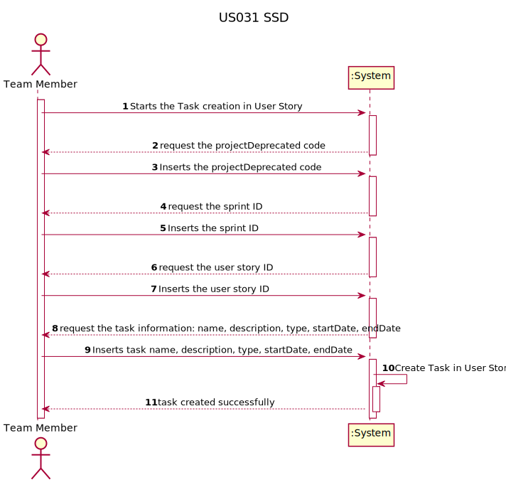
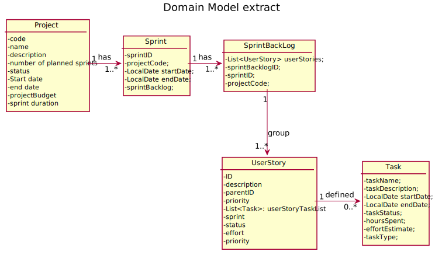
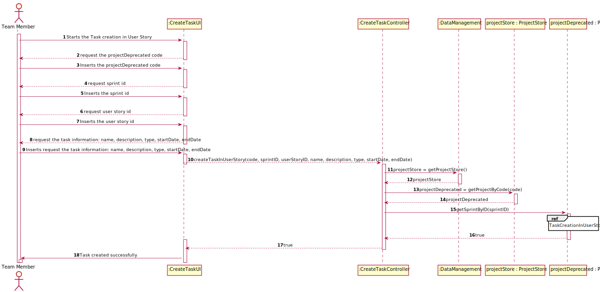
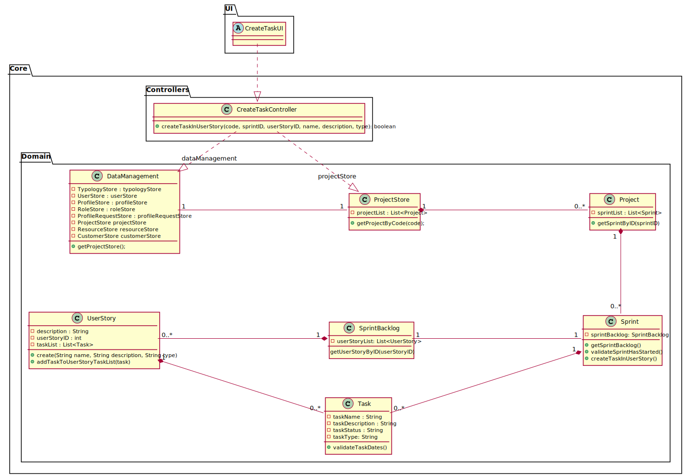

# US 31 -  As Team Member, I want to create a task in a user story

## 1. Requirements Engineering

### 1.1. User Story Description

As Team Member, I want to create a task in a user story

### 1.2. Customer Specifications and Clarifications 

* Questão:
>O tipo de «task» deve ser selecionado a partir de uma lista (ex: Meeting, Documentation, Design, Implementation, Testing, Deployment,...)? Ou é uma descrição introduzida pelo ator?

* Resposta:
>Poderá ser interessante haver uma padronização por projeto, mas ainda não há user stories nesse sentido.

--//--

* Questão:
>Qual é a diferença entre os estados «Blocked» e «Finished» de uma «task»?

* Resposta:
>Normalmente, de blocked pode passar a running.
Eu diria que fazia sentido considerar ainda o estado "cancelled", mas ainda temos tempo para abordar esse assunto.
### 1.3. Acceptance Criteria

A task can only be created in a User Story that belongs to the Sprint Backlog of the currently active Sprint. In other words, a task can't be created in a User Story that belongs to a planned or already finished Sprint.
### 1.4. Found out Dependencies

US017 - As Authenticated User, I want to get a list of all projects I'm currently allocated to.
US023 - As Team Member, I want to add a user story in the product backlog to the sprint backlog.

### 1.5 Input and Output Data

> Input:
* Project code : String
* Sprint ID : int
* User Story ID : int
* Task name : String
* Task description : String
* Task type : String

> Output:
* Task creation in User Story Successful/Unsuccessful : boolean

### 1.6. System Sequence Diagram (SSD)

### 1.7 Other Relevant Remarks

No other relevant remarks were found.

## 2. OO Analysis

### 2.1. Relevant Domain Model Excerpt 

### 2.2. Other Remarks

No other remarks.

## 3. Design - User Story Realization 

### 3.1. Rationale

| Interaction ID | Question: Which class is responsible for... | Answer  | Justification (with patterns)  |
|:-------------  |:--------------------- |:------------|:---------------------------- |
| Step 1  		 |	Interacting with the actor?	 | CreateTaskUI  | Responsible to be the gateway between the Actor and the Domain layer and their interactions with one another.                            |
| Step 2		 |	Who responds from an input event generated by the UI? | CreateTaskController  | Responsible to responding to an input event in the system generated by the User Interface.                            |
| Step 3	     |	Keeping the list of projects	 | DataManagement | Responsibility of keeping the list of projects (GRASP Principle of Information Expert, Pure Fabrication, High Cohesion / Low Coupling).                             |
| Step 4	     |	Knowing all the Projects  | ProjectStore | Responsibility of knowing all Projects (GRASP Principle of Information Expert, Pure Fabrication, High Cohesion/low Coupling, Creator).                           |
| Step 5 		 |	Accessing the current Sprint | Project | Conceptual class created based on the business rules. Responsible for keeping the list of Sprints and knowing which Sprint is currently active. (GRASP Principle of Information Expert, Creator).                             |
| Step 6    	 |	Accessing the Sprint Backlog | Sprint | Conceptual class created based on the business rules, with the responsibility of accessing its own Sprint Backlog.                            |              
| Step 6		 |	Searching for a User Story by id | SprintBacklog | GRASP Principle of Information Expert.                            |              
| Step 7 		 |	Creating a new Task | Sprint | GRASP Principle of Creator and Information Expert.                          |
| Step 8         |  Access if the Task is in a valid state | Task | Grasp Principle of High Cohesion / Low Coupling and Single Responsibility Principle.|
| Step 9         |  Storing the created Task in a User Story| UserStory | Conceptual class created based on the business rules with the GRASP Principle of High Cohesion / Low Coupling and Single Responsibility Principle.
| Step 10        |  Providing a response to the UI  |   CreateTaskController | -
| Step 11        |  Presenting a success message to the Actor| CreateTaskUI | -
### Systematization ##

According to the taken rationale, the conceptual classes promoted to software classes are: 

* Project
* Sprint
* SprintBackLog
* UserStory
* Task

Other software classes (i.e. Pure Fabrication) identified: 
 * CreateTaskUI  
 * CreateTaskController

## 3.2. Sequence Diagram (SD)

## 3.3. Class Diagram (CD)

# 4. Tests 
*In this section, it is suggested to systematize how the tests were designed to allow a correct measurement of requirements fulfilling.* 

**_DO NOT COPY ALL DEVELOPED TESTS HERE_**

**Test 1:** Check that it is not possible to create an instance of the Example class with empty values. 

    class ExampleFixture : public ::testing::Test {
        TEST_F(ExampleFixture, CreateWithEmptyCode){
            EXPECT_THROW(new Example(L"",L"Example One"),std::invalid_argument);
        }
    }
	

*It is also recommended organizing this content by subsections.* 

# 5. Construction (Implementation)

*In this section, it is suggested to provide, if necessary, some evidence that the construction/implementation is in accordance with the previously carried out design. Furthermore, it is recommeded to mention/describe the existence of other relevant (e.g. configuration) files and highlight relevant commits.*

*It is also recommended to organize this content by subsections.* 

# 6. Integration and Demo 

*In this section, it is suggested to describe the efforts made to integrate this functionality with the other features of the system.*

# 7. Observations

*In this section, it is suggested to present a critical perspective on the developed work, pointing, for example, to other alternatives and or future related work.*

