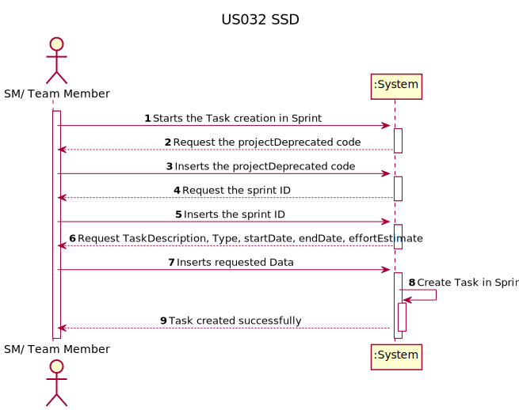
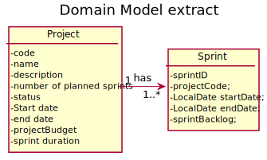
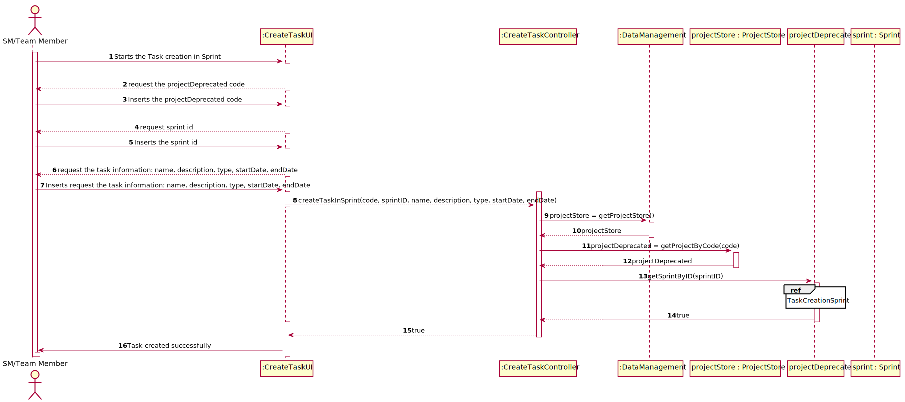
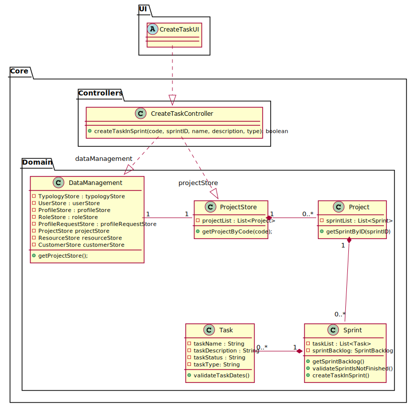

# US 32 -  As SM/Team Member, I want to create a task outside the scope of a user story

## 1. Requirements Engineering

### 1.1. User Story Description

As SM/Team Member, I want to create a task outside the scope of a user story

### 1.2. Customer Specifications and Clarifications

* Questão:
>Para além duma referência à UserStory a que pertence, quais serão as diferenças de uma task fora do âmbito da User Story e de uma que pertence a uma User Story?

* Resposta:
>Provavelmente nenhuma.

--//--

* Questão:
>Uma tarefa fora do contexto de user story estará sempre e apenas associada a um sprint? Ou poderá haver tasks associadas diretamente ao projeto?

* Resposta:
>Não há tasks fora do contexto de um sprint.

--//--

* Questão:
>O tipo de «task» deve ser selecionado a partir de uma lista (ex: Meeting, Documentation, Design, Implementation, Testing, Deployment,...)? Ou é uma descrição introduzida pelo ator?

* Resposta:
>Poderá ser interessante haver uma padronização por projeto, mas ainda não há user stories nesse sentido.

--//--

* Questão:
>Qual é a diferença entre os estados «Blocked» e «Finished» de uma «task»?

* Resposta:
>Normalmente, de blocked pode passar a running.
Eu diria que fazia sentido considerar ainda o estado "cancelled", mas ainda temos tempo para abordar esse assunto.

### 1.3. Acceptance Criteria

A task can only be created in a Sprint that is not yet finished. In other words, the Sprint is planned or currently active.

### 1.4. Found out Dependencies

No dependencies found.

### 1.5 Input and Output Data

> Input:
* Project code : String
* Sprint ID : int
* Task name : String
* Task description : String
* Task type : String

> Output:
* Task creation in Sprint Successful/Unsuccessful : boolean

### 1.6. System Sequence Diagram (SSD)

### 1.7 Other Relevant Remarks

No other relevant remarks were found.

## 2. OO Analysis

### 2.1. Relevant Domain Model Excerpt

### 2.2. Other Remarks

No other remarks.

## 3. Design - User Story Realization

### 3.1. Rationale

**The rationale grounds on the SSD interactions and the identified input/output data.**

| Interaction ID | Question: Which class is responsible for... | Answer  | Justification (with patterns)  |
|:-------------  |:--------------------- |:------------|:---------------------------- |
| Step 1  		 |	Interacting with the actor? | CreateTaskUI   |  Pure Fabrication: there is no reason to assign this responsibility to any existing class in the Domain Model.           |
| Step 2         |	Creating the Task in User Story | Sprint | Knows its Sprint Backlog which contains the Sprint's User Stories.                            |

### Systematization ##

According to the taken rationale, the conceptual classes promoted to software classes are:

* Project
* Sprint

Other software classes (i.e. Pure Fabrication) identified:
* CreateTaskUI
* CreateTaskController

## 3.2. Sequence Diagram (SD)

## 3.3. Class Diagram (CD)

# 4. Tests
*In this section, it is suggested to systematize how the tests were designed to allow a correct measurement of requirements fulfilling.*

**_DO NOT COPY ALL DEVELOPED TESTS HERE_**

**Test 1:** Check that it is not possible to create an instance of the Example class with empty values.

    class ExampleFixture : public ::testing::Test {
        TEST_F(ExampleFixture, CreateWithEmptyCode){
            EXPECT_THROW(new Example(L"",L"Example One"),std::invalid_argument);
        }
    }

*It is also recommended organizing this content by subsections.*

# 5. Construction (Implementation)

*In this section, it is suggested to provide, if necessary, some evidence that the construction/implementation is in accordance with the previously carried out design. Furthermore, it is recommeded to mention/describe the existence of other relevant (e.g. configuration) files and highlight relevant commits.*

*It is also recommended to organize this content by subsections.*

# 6. Integration and Demo

*In this section, it is suggested to describe the efforts made to integrate this functionality with the other features of the system.*

# 7. Observations

*In this section, it is suggested to present a critical perspective on the developed work, pointing, for example, to other alternatives and or future related work.*

