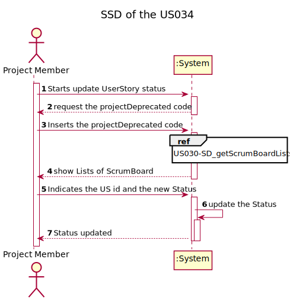
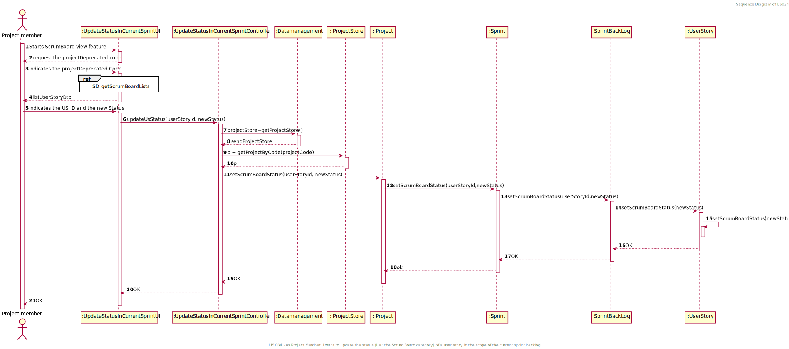
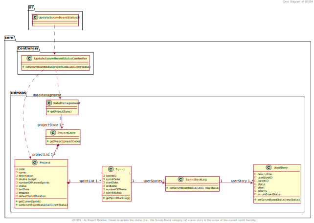

# US 34 - I want to update the status of a user story in the scope of the current sprint backlog

(Content should be revised/updated to be in accordance with US034)

## 1. Requirements Engineering

### 1.1. User Story Description

*As Project Member, I want to update the status (i.e.: the Scrum Board category) of a user story in the scope of the current sprint backlog.*

### 1.2. Customer Specifications and Clarifications 
**From the specifications document:**

n/a

**From the client clarifications:**

* Quando damos por concluída uma US, é necessário verificar o estados das Task's da US (caso existam) e bloquear a alteração de Status da US caso as Task's não estejam concluídas? Ou pelo contrario mudamos o estado à US e às respetivas Task's? (G4, 30/01)
  * Numa primeira abordagem não será necessário verificar se há tasks por concluir.

### 1.3. Acceptance Criteria

Not necessary to verify the status of the task's from the user story.
### 1.4. Found out Dependencies

Dependency of the US030: As Team Member, I want to view the Scrum Board of current sprint.

### 1.5 Input and Output Data

**Input Data:**
* Typed data:
  * projectDeprecated Code,
  * user story id,
  * new status.

* Selected data:
  * User story.

**Output Data:**
  * Lists grouped by ScrumBoard status of the User Stories.
  * (In)Sucess of the operation

### 1.6. System Sequence Diagram (SSD)

### 1.7 Other Relevant Remarks

n/a

## 2. OO Analysis

### 2.1. Relevant Domain Model Excerpt 

### 2.2. Other Remarks

n/a

## 3. Design - User Story Realization 

### 3.1. Rationale

**The rationale grounds on the SSD interactions and the identified input/output data.**

| Interaction ID | Question: Which class is responsible for... | Answer | Justification (with patterns) |
|:---------------|:--------------------------------------------|:-------|:------------------------------|
| Step 1  		 |	... interacting with the actor? | UpdateScrumBoardStatuUI   |  Pure Fabrication: there is no reason to assign this responsibility to any existing class in the Domain Model.           |
| |	... coordinating the US? |UpdateScrumBoardStatuController | Controller                             |
| 			  		 |	... knows all Sprint userStory's? | SprintBackLog   | contains all the userStorys from a Sprint.   |
| Step 2  		     | 	... list the ScrumBoard List        |              ScrumBordViewUI                 | i.e. User interface
| Step 3  		     | 	... set the new status        |              ScrumBordViewController                 |Controller

### Systematization ##

According to the taken rationale, the conceptual classes promoted to software classes are: 

* Project
* Sprint
* SprintBackLog
* UserStory

Other software classes (i.e. Pure Fabrication) identified: 
 * UpdateScrumBoardStatusUI  
 * UpdateScrumBoardStatusController

## 3.2. Sequence Diagram (SD)

## 3.3. Class Diagram (CD)

# 4. Tests 

**Test 1:** Check an invalid projectDeprecated Code.

    @Test
    void setStatusDataInvalidProjectCode() {
        //arrange
        DataManagement dataManagement = new DataManagement();
        UpdateScrumBoardStatusController updateScrumBoardStatusController = new
                UpdateScrumBoardStatusController(dataManagement);
        LocalDate sprintFakeNowDate = LocalDate.of(2023, 2,
                8);
        //act & assert
        IllegalArgumentException exception = assertThrows
                (IllegalArgumentException.class, () ->
                        updateScrumBoardStatusController.setStatus(null,
                                1,"todo",sprintFakeNowDate));
        assertEquals("Invalid data", exception.getMessage());
    }

**Test 2:** Check if the status modification was properly applied.

	 @Test
    void setStatus(){
        DataManagement dataManagement = new DataManagement();
        UpdateScrumBoardStatusController updateScrumBoardStatus =
                new UpdateScrumBoardStatusController(dataManagement);
        ProjectStore projectStore = dataManagement.getProjectStore();
        String projectCode1 = "Z123";
        String name = "ABC";
        String description = "Description";
        int projectNumberOfPlannedSprints = 4;
        String status = "Planned";
        LocalDate startDate1 = LocalDate.of(2023, 1, 6);
        LocalDate endDate1 = LocalDate.of(2024, 2, 6);
        Typology typology = new Typology();
        Customer customer = new Customer("Company",
                "Management", 123456789);
        int sprintDuration = 2;
        double projectBudget = 1000.0;
        LocalDate nowDate = LocalDate.of(2023, 1, 31);
        Project projectTest1 = new Project(projectCode1, name, description,
                projectNumberOfPlannedSprints, status, startDate1,
                endDate1, projectBudget, typology, sprintDuration,
                customer);

        LocalDate sprintStartDate1 = LocalDate.of(2023, 2,
                7);
        LocalDate sprintFakeNowDate = LocalDate.of(2023, 2,
                8);
        projectStore.addCreatedProjectToProjectList(projectTest1);
        //Act

        projectTest1.createNewSprint(sprintStartDate1, nowDate);
        projectTest1.startASprint(1,sprintFakeNowDate);

        Sprint sprint = projectTest1.getSprintById(1);
        SprintBacklog sprintBacklog = sprint.getSprintBacklog();

        UserStory userStory1 = new UserStory("1111111111111111111111111" +
                "", 1, 1);
        userStory1.setScrumBoardStatus("todo");
        //Act
        sprintBacklog.addUserStoryToSprintBacklog(userStory1);
        String expected = "in progress";
        updateScrumBoardStatus.setStatus("Z123",1,
                "in progress", sprintFakeNowDate);
        String result = userStory1.getScrumBoardStatus();
        //Assert
        assertEquals(expected, result);
    }

# 5. Construction (Implementation)
n/a
# 6. Integration and Demo 

n/a

# 7. Observations

n/a

